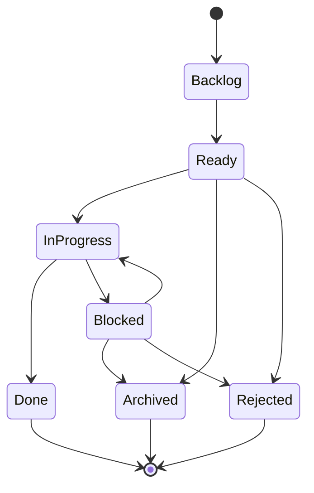

# MemorySmith.Agent — Task System & Data Validation Reference

> **Agent:** 9 of 10 (Memory Audit Sweep)
> **Date:** 2026-07-10
> **Confidence:** 95%
> **Status:** Complete

---

## 1. Task File Schema

### Required Fields (per `AGENTS.md` and `Data/Pages/guides/task-governance.md`)

| Field | Type | Required | Notes |
|-------|------|----------|-------|
| `id` | string | Yes | `tsk-XXXX-descriptive-slug` — must match filename |
| `key` | string | Yes | `TSK-XXXX` — unique identifier |
| `title` | string | Yes | Short descriptive title |
| `description` | string | Yes | Scope, acceptance criteria, file references |
| `type` | string | Yes | `"Task"` is the canonical value |
| `status` | string | Yes | One of 7 allowed values (see below) |
| `priority` | string | Yes | One of 4 allowed values (see below) |
| `createdAtUtc` | datetime | Yes | ISO 8601 UTC |
| `updatedAtUtc` | datetime | Yes | ISO 8601 UTC |
| `revision` | integer | Yes | Incremented on every mutation |

### Optional Fields (commonly used)

| Field | Type | Notes |
|-------|------|-------|
| `assigneeMode` | string | `"Custom"` or `"Directory"` |
| `assigneeCustomText` | string | e.g., `"Agent"`, `"Copilot"` |
| `assigneeDirectoryId` | string|null | Directory user ID when mode is Directory |
| `reporter` | string | Who logged the task |
| `labels` | string[] | Lowercase, hyphen-separated (see conventions) |
| `comments` | array | Objects with `id`, `author`, `body`, `createdAtUtc` |
| `attachments` | array | File attachments |
| `externalLinks` | array | External URL references |
| `linkedPages` | string[] | Page slugs linked to this task |
| `epicId` | string|null | Parent epic task id |
| `parentId` | string|null | Parent task id |
| `dueDateUtc` | datetime|null | Optional due date |
| `completedAtUtc` | datetime|null | Set when moved to Done |
| `isArchived` | bool | Legacy archive flag (prefer `Archived` status) |
| `hasLoadError` | bool | Set by runtime when record fails to parse |
| `loadError` | string|null | Error message from parse failure |
| `sourceFilePath` | string|null | Source file path |

### Field Casing

**All fields use camelCase** (`id`, `key`, `title`, `status`, `description`, `createdAtUtc`, `updatedAtUtc`, etc.). This is enforced by AGENTS.md and the validation script.

### ID Format

Regex: `^tsk-\d{4}-[a-z0-9-]+$`

Examples:
- `tsk-0001-implement-websocket-bridge-full`
- `tsk-0358-create-world-kb-setup-guide-and-dedicated-instance-deployment`

The filename must match the `id` value exactly (with `.json` extension).

### Key Format

Regex: `^TSK-\d{4,}$`

Examples: `TSK-0001`, `TSK-0358`

**Source:** `AGENTS.md` lines 101-103, validation in `Scripts/Test-TaskRecords.ps1` line 61.

---

## 2. Status Values & Lifecycle

### Allowed Statuses (from AGENTS.md §Task Governance)

| Status | Meaning |
|--------|---------|
| `Backlog` | Not yet started, awaiting prioritization |
| `Ready` | Prioritized and scoped, ready to begin |
| `InProgress` | Actively being worked on |
| `Blocked` | Cannot proceed; reason documented in comments |
| `Done` | Complete with evidence comment |
| `Archived` | Superseded or no longer relevant; rationale documented |
| `Rejected` | Considered and declined; rationale documented |

### Status Lifecycle Diagram



No other status values are permitted. Non-standard statuses (`Open`, `Completed`, `Closed - Merged into X`) must be migrated to the canonical set.

**Source:** `AGENTS.md` lines 107-122, validated by `Test-TaskRecords.ps1` status whitelist.

### Old .md Companion Files

The Agent repo has **26 `.md` companion files** (`TSK-0100.md` through `TSK-0128-timeout-event-latency-mismatch.md`) that contain supplementary design notes. These are explicitly **not errors** — the validation script comments say: "NOTE: .md companion files alongside .json files are supplementary documentation. They are NOT errors."

**Source:** `Scripts/Test-TaskRecords.ps1` lines 93-95.

---

## 3. Priority Values

| Priority | Meaning |
|----------|---------|
| `Critical` | P0 — blocking, must fix immediately |
| `High` | P1 — important, next sprint |
| `Medium` | P2 — standard priority |
| `Low` | P3 — nice to have |

- No other priority values permitted.
- Priority codes (`p0`, `p1`, `P0`) are **not allowed as labels** — the `priority` field is the single source of truth.
- The validation script checks for `^[Pp][0-9]$` patterns in labels and rejects them.

**Source:** `AGENTS.md` lines 124-126, `Test-TaskRecords.ps1` lines 84-88.

---

## 4. Task Count & Status Distribution

### MemorySmith.Agent Repo (`D:\@Repos\MemorySmith.Agent\Data\Tasks`)

| Metric | Count |
|--------|-------|
| Total JSON files | **352** |
| Total .md companion files | **26** |

**Status Distribution:**
| Status | Count | Percentage |
|--------|-------|------------|
| Archived | 1 | 0.3% |
| Backlog | 149 | 42.3% |
| Blocked | 1 | 0.3% |
| Done | 176 | 50.0% |
| Ready | 24 | 6.8% |
| Rejected | 1 | 0.3% |

**Priority Distribution:**
| Priority | Count |
|----------|-------|
| Critical | 70 |
| High | 136 |
| Low | 24 |
| Medium | 122 |

**Note:** The Agent repo has 0 `InProgress` tasks and only 1 `Blocked` / 1 `Rejected` — these states are rarely used.

### MemorySmith Repo (`D:\@Repos\MemorySmith\Data\Tasks`)

| Metric | Count |
|--------|-------|
| Total JSON files | **312** |
| Total .md companion files | **0** |

**Status Distribution:**
| Status | Count | Percentage |
|--------|-------|------------|
| Archived | 2 | 0.6% |
| Backlog | 163 | 52.2% |
| Done | 133 | 42.6% |
| InProgress | 5 | 1.6% |
| Ready | 9 | 2.9% |

**Priority Distribution:**
| Priority | Count |
|----------|-------|
| Critical | 12 |
| High | 97 |
| Low | 8 |
| Medium | 195 |

**Source:** Task audit 2026-07-10 (`/memories/repo/task-audit-20260710.md`), verified against live file scan.

### Notable Observations

- **MemorySmith repo has 0 `Blocked` and 0 `Rejected` tasks** — either these states are unused, or blocked/rejected tasks get Archived instead.
- **~148 Backlog tasks in MemorySmith repo are stale** (updated before 2026-06-10, >30 days old).
- **Oldest MemorySmith cohort** dates to 2026-05-23 (~48 days stale at audit time).
- **Agent repo has 149 Backlog** — similar backlog proportion (~42% vs ~52%).
- **Agent repo has 176 Done vs MemorySmith's 133 Done** — more tasks completed in Agent repo.
- **Agent repo has significantly more Critical tasks** (70 vs 12) — reflects the different nature (agent runtime issues vs product features).

**Source:** `/memories/repo/task-audit-20260710.md`, verified against live file scan on 2026-07-10.

---

## 5. Label Conventions

### Prefix Conventions (from AGENTS.md)

| Prefix | Purpose | Examples |
|--------|---------|---------|
| `sprint-XX` | Sprint association | `sprint-53`, `sprint-58` |
| `domain:xxx` | Domain area | `domain:mineflayer`, `domain:chat` |
| `type:xxx` | Classification | `type:bug`, `type:refactor`, `type:feature` |

### All `domain:` Labels (57 unique)

```
domain:adapter, domain:agent, domain:agent-loop, domain:architecture,
domain:audit, domain:autonomy, domain:blueprint, domain:bridge, domain:build,
domain:chat, domain:cleanup, domain:combat, domain:construction, domain:core,
domain:crafting, domain:creative, domain:dashboard, domain:docs,
domain:documentation, domain:entities, domain:entity, domain:evaluation,
domain:evaluator, domain:execution, domain:gathering, domain:infra,
domain:inventory, domain:items, domain:llm, domain:logging, domain:memory,
domain:minecraft, domain:mineflayer, domain:movement, domain:navigation,
domain:observability, domain:personality, domain:planner, domain:planning,
domain:quality, domain:recovery, domain:registry, domain:runtime, domain:safety,
domain:scripts, domain:search, domain:security, domain:sequence, domain:testing,
domain:tools, domain:ui, domain:vision, domain:world, domain:world-scanning,
domain:world-state, domain:worldmodel, domain:worldstate
```

### All `type:` Labels (20 unique)

```
type:analysis, type:architecture, type:bug, type:chore, type:cleanup,
type:codesmell, type:compliance, type:design, type:docs, type:documentation,
type:enhancement, type:feature, type:housekeeping, type:infrastructure,
type:planning, type:prompt, type:refactor, type:regression-test, type:security,
type:tool
```

### Prohibited Labels

- **Priority codes** (`p0`, `p1`, `P0`, etc.) are not allowed as labels — use the `priority` field instead.
- **Duplicate casing variants** (e.g., `P1` vs `p1`) are not permitted.

### Rules

- Labels use **lowercase with hyphen-separated words**.
- Unprefixed labels are also used (e.g., `blocker`, `future`, `game-testing`, `websocket`, `phase-1`).

**Source:** `AGENTS.md` lines 128-134, verified against live label data from 352 task files.

---

## 6. Validation Script Inventory

### MemorySmith.Agent Repo

| Script | Path | What It Checks |
|--------|------|----------------|
| `Test-TaskRecords.ps1` | `Scripts/Test-TaskRecords.ps1` | JSON parse validity, status whitelist (7 values), priority whitelist (4 values), `id` matches filename, `key` matches `TSK-\d{4,}`, duplicate ID/key detection, embedded control chars in string fields, priority-as-label check (`^[Pp][0-9]$`), orphan `.md` files (explicitly allowed, not errors) |
| `Normalize-TaskRecords.ps1` | `Scripts/Normalize-TaskRecords.ps1` | Bulk normalization: fixes `id` when it equals `TSK-XXXX` but filename is `tsk-XXXX-slug`, adds missing `key` from filename, strips priority labels from labels array |
| `Fix-CorruptedTasks.py` | `Scripts/Fix-CorruptedTasks.py` | Reconstructs severely corrupted JSON (unescaped quotes, literal newlines in strings, missing closing braces). Used for recovery. |
| `Create-DebugTasks.ps1` | `Scripts/Create-DebugTasks.ps1` | Creates debug tasks via MemorySmith REST API (`/api/tasks`) for testing |
| `Triage-BacklogTasks.ps1` | `Scripts/Triage-BacklogTasks.ps1` | Bulk labels/triage: adds `epicId`, `domain:xxx`, `type:xxx` labels to task groups by epic |
| `Decode-AllBase64.ps1` | `Scripts/Decode-AllBase64.ps1` | (Related) decodes base64-encoded files |

**No other data validation scripts exist** in the Agent repo (no memory/page validation).

### MemorySmith Repo

| Script | Path | What It Checks |
|--------|------|----------------|
| `Test-TaskRecords.ps1` | `Scripts/Test-TaskRecords.ps1` | JSON parse, status whitelist, `id`-filename match, `key` format (`TSK-\d{4,}`), duplicate ID/key, `linkedPages` slug safety check (no path traversal, valid segments). **No priority validation** (unlike Agent repo version). |
| `Test-MemoryRecords.ps1` | `Scripts/Test-MemoryRecords.ps1` | Runs `LiveMemoryRecordValidationTests` via `dotnet test` — delegates to NUnit tests |
| `Test-PageLinks.ps1` | `Scripts/Test-PageLinks.ps1` | Validates markdown links in `Data/Pages/*.md`: enforces relative `.md` link style, checks target file existence, rejects backslash paths |
| `Test-PagePathLiterals.ps1` | `Scripts/Test-PagePathLiterals.ps1` | Validates plain-text `Data/Pages/...` path literals in markdown: rejects backslashes, checks target file existence, suggests replacements for moved pages |
| `Validate-Repo.ps1` | `Scripts/Validate-Repo.ps1` | **Orchestrator** — runs: build, test suite, `Test-TaskRecords`, `Test-MemoryRecords`, `Test-PageLinks`, `Test-PagePathLiterals`. Optional: `-IncludeCoverage`, `-IncludeE2E`, `-IncludeDocs`. |
| `Test-PagePathLiterals.ps1` | `Scripts/Test-PagePathLiterals.ps1` | Detailed page path literal validation |

### Schema Files

| File | Purpose |
|------|---------|
| `D:\@Repos\MemorySmith\Schemas\memory.schema.json` | JSON Schema for MemoryRecord objects (validates Id, Content, Status, Confidence, Tags, References, Conflicts, SourceLinks) |
| *(No task schema file)* | Task schema is enforced programmatically via `Test-TaskRecords.ps1` rather than a JSON Schema file |

### Cross-Repo Differences in Validation

| Check | Agent Repo | MemorySmith Repo |
|-------|-----------|-----------------|
| Status whitelist | ✅ Yes | ✅ Yes |
| Priority whitelist | ✅ Yes | ❌ No |
| `id`-filename match | ✅ Yes | ✅ Yes |
| `key` format check | ✅ Yes | ✅ Yes |
| Duplicate ID/key | ✅ Yes | ✅ Yes |
| Control chars in strings | ✅ Yes | ❌ No |
| Priority-as-label check | ✅ Yes | ❌ No |
| `linkedPages` slug safety | ❌ No | ✅ Yes |

---

## 7. CI Task Validation

### MemorySmith.Agent CI (`.github/workflows/ci.yml`)

Steps in order:
1. Setup .NET 10.0.x
2. `dotnet restore MemorySmith.Agent.slnx`
3. `dotnet build ... --configuration Release`
4. `dotnet test ...` with XPlat Code Coverage
5. **Validate task records** (`pwsh ./Scripts/Test-TaskRecords.ps1`)

Runs on: push to `main`/`master`/`feature/**`, PR to `main`/`master`.

**Note:** No memory/page validation in Agent repo CI.

### MemorySmith CI (`.github/workflows/ci.yml`)

Steps in order:
1. Setup .NET 10.0.x
2. `dotnet restore`
3. **Validate task records** (before build — catches data issues early)
4. **Validate memory records**
5. **Validate page links**
6. **Validate page path literals**
7. `dotnet build --no-restore --configuration Release`
8. `dotnet test ...` with coverage
9. Coverage report generation + upload
10. Browser route-smoke regression (separate job)
11. Browser navigation-freeze regression (separate job)

Runs on: same triggers as Agent.

**Source:** `.github/workflows/ci.yml` in each repo, verified against live files.

---

## 8. Task Creation Process & Lifecycle

### Creation Steps (from AGENTS.md §Task Governance)

1. **Check for existing keys** — scan `Data/Tasks/` for the next available `TSK-XXXX`.
2. **Use the MCP tool** — `memorysmith_task_create` when available, or copy a validated template.
3. **Set `id`** — `tsk-XXXX-descriptive-slug` (must match regex `^tsk-\d{4}-[a-z0-9-]+$`).
4. **Set `key`** — `TSK-XXXX` (must match regex `^TSK-\d{4}$`).
5. **Set `status`** to `Backlog`.
6. **Set `createdAtUtc`** and `updatedAtUtc` to current UTC time.
7. **Add relevant labels** following prefix conventions.
8. **Run validation:** `pwsh ./Scripts/Test-TaskRecords.ps1`

### Lifecycle Rules

- **`Backlog → Ready`**: Task is prioritized and scoped.
- **`Ready → InProgress`**: Actively being worked on.
- **`InProgress → Done`**: Requires an evidence comment with file paths, test results, or sprint handoff reference.
- **`InProgress → Blocked`**: Cannot proceed; reason must be documented in comments.
- **`Blocked → InProgress`**: Block resolved.
- **`→ Archived`**: Terminal — superseded or no longer relevant; rationale must be documented.
- **`→ Rejected`**: Terminal — considered and declined; rationale must be documented.
- **Always increment `revision`** on changes.
- **Always update `updatedAtUtc`** on changes.

### Evidence Standard for Done

Moving to `Done` requires a comment with:
- File paths changed
- Test results or validation output
- Sprint handoff reference (if applicable)

### Task Creation via REST API

The MemorySmith app exposes `/api/tasks` (POST) for task creation. The `Create-DebugTasks.ps1` script demonstrates this pattern for the Agent repo.

---

## 9. MCP Task Tool Integration

### Available MCP Tools (MemorySmith MCP server)

| Tool | Purpose |
|------|---------|
| `mcp_memorysmithw2_memorysmith_task_create` | Create a new task record. Supports: title, description, type, status, priority, assigneeMode, assigneeDirectoryId, assigneeCustomText, reporter, labels, dueDateUtc, epicId, parentId, slug. |
| `mcp_memorysmithw2_memorysmith_task_list` | List tasks by query, status, assignee, and limit (clamped 1-100). |
| `mcp_memorysmithw2_memorysmith_task_get` | Fetch a single task by id or key (e.g., `tsk-0171-agent-task-tools` or `TSK-0171`). |
| `mcp_memorysmithw2_memorysmith_task_update` | Update editable task fields: title, description, type, priority, assigneeMode/Id/Text, reporter, labels, dueDateUtc, epicId, parentId. |

### Task Tools Coverage

The MemorySmith app has a dedicated task workbench UI (`/tasks` route) and REST API (`/api/tasks`). The MCP tools provide agent-accessible task management.

**Source:** MCP tool definitions in the system, MemorySmith task workbench UI.

---

## 10. Roadmap Structure & Sprint Planning Conventions

### Sprint Labeling

Tasks are associated with sprints via labels:
- `sprint-37`, `sprint-42`, `sprint-45`, `sprint-46`, `sprint-47`, `sprint-49`
- `sprint-51`, `sprint-51b`, `sprint-52`, `sprint-53`, `sprint-54`, `sprint-55`
- `sprint-56`, `sprint-57`, `sprint-58`, `sprint-59`, `sprint-60`

Wave labels are also used within sprints:
- `wave-a`, `wave-b`, `wave-c`, `wave-d`

### Epic Structure

Tasks can be linked to epics via `epicId` field:
- `epicId: "tsk-0146-entity-observation-scene"` — the entity/observation/scene epic (TSK-0146 through TSK-0155)
- Epics are themselves regular task files with task IDs.

### Phase Labels

Historical phase labels still exist in the Agent repo:
- `phase-1` (early game-testing tasks)
- `phase-4` (infrastructure/planning tasks)

### Agent Repo Task Numbering

- TSK-0001 through TSK-0358 as of 2026-07-10 (352 tasks)
- Gaps exist (e.g., TSK-0182 through TSK-0185 are missing)
- Numbering is sequential but gaps are normal (tasks may be renumbered, deleted, or merged)

### MemorySmith Repo Task Numbering

- TSK-0001 through TSK-3014 as of 2026-07-10 (312 tasks)
- Large gaps exist (TSK-0101 through TSK-0103, TSK-0104 through TSK-0113, etc.)
- Two numbering tracks: 4-digit (0001-0300) and 4-digit with different prefix (3001-3014)
- The MemorySmith repo has a separate numbering space from the Agent repo

---

## 11. Audit Synthesis Council Findings Summary

### Key Findings (from `/memories/repo/task-audit-20260710.md`)

1. **All statuses and priorities are canonical** in MemorySmith repo — no non-standard values found.
2. **133 Done (42.6%)**, 163 Backlog (52.2%), 9 Ready (2.9%), 5 InProgress (1.6%), 2 Archived (0.6%).
3. **148 Backlog tasks stale** (updated before 2026-06-10, >30 days old).
4. **No tasks carry `Blocked` or `Rejected`** in MemorySmith repo — possibly unused, or such tasks get Archived instead.
5. **Only 2 Archived tasks** — `Archived` is rarely used.
6. **5 InProgress tasks**, 2 haven't been touched in ~43 days (TSK-0201, TSK-0203).

### Agent Repo Findings (from this audit)

1. **176 Done (50.0%)**, 149 Backlog (42.3%), 24 Ready (6.8%), 1 Archived, 1 Blocked, 1 Rejected.
2. **0 InProgress tasks** — the Agent repo doesn't use the InProgress state.
3. **70 Critical priority tasks** — significantly more than MemorySmith (12).
4. **26 .md companion files** exist alongside JSON for tasks TSK-0100 through TSK-0128.
5. **Priority-as-label issue** has been cleaned up — the `Normalize-TaskRecords.ps1` script was run.
6. **No memory/page validation scripts** in Agent repo — contrast with MemorySmith which has a full validation suite.

### Cross-Repo Differences

| Aspect | MemorySmith.Agent | MemorySmith |
|--------|-------------------|-------------|
| Total tasks | 352 | 312 |
| Uses InProgress | No (0) | Yes (5) |
| Uses Blocked | Yes (1) | No (0) |
| Priority validation | Yes | No |
| linkedPages validation | No | Yes |
| Memory validation | No | Yes |
| Page link validation | No | Yes |
| CI validation steps | 1 (task) | 4 (task, memory, pages, paths) |
| .md companion files | 26 | 0 |
| Task numbering | 0001-0358 | 0001-3014 |

---

## 12. Task Tools & Scripts Quick Reference

### Validation Commands

```powershell
# Agent repo — task records only
pwsh ./Scripts/Test-TaskRecords.ps1

# MemorySmith repo — task records
pwsh ./Scripts/Test-TaskRecords.ps1

# MemorySmith repo — full validation suite
pwsh ./Scripts/Validate-Repo.ps1

# MemorySmith repo — with extras
pwsh ./Scripts/Validate-Repo.ps1 -IncludeCoverage
pwsh ./Scripts/Validate-Repo.ps1 -IncludeE2E
pwsh ./Scripts/Validate-Repo.ps1 -IncludeDocs
pwsh ./Scripts/Validate-Repo.ps1 -SkipBuild -SkipTests
```

### Maintenance Scripts

```powershell
# Agent repo — normalize task records (fix id/key drift, strip priority labels)
pwsh ./Scripts/Normalize-TaskRecords.ps1

# Agent repo — triage backlog tasks (add epics, domain/type labels)
pwsh ./Scripts/Triage-BacklogTasks.ps1

# Agent repo — create debug tasks via REST API
pwsh ./Scripts/Create-DebugTasks.ps1
```

### MCP Tool Usage

```
memorysmith_task_create(title="...", description="...", status="Backlog", priority="Medium", ...)
memorysmith_task_list(status="Backlog", limit=25)
memorysmith_task_get(idOrKey="TSK-0358")
memorysmith_task_update(idOrKey="TSK-0358", status="InProgress")
```

---

## 13. File Paths Reference

| Item | Path |
|------|------|
| Agent task records | `D:\@Repos\MemorySmith.Agent\Data\Tasks\` |
| MemorySmith task records | `D:\@Repos\MemorySmith\Data\Tasks\` |
| Agent task validation | `D:\@Repos\MemorySmith.Agent\Scripts\Test-TaskRecords.ps1` |
| MemorySmith task validation | `D:\@Repos\MemorySmith\Scripts\Test-TaskRecords.ps1` |
| MemorySmith memory validation | `D:\@Repos\MemorySmith\Scripts\Test-MemoryRecords.ps1` |
| MemorySmith page link validation | `D:\@Repos\MemorySmith\Scripts\Test-PageLinks.ps1` |
| MemorySmith page path literal validation | `D:\@Repos\MemorySmith\Scripts\Test-PagePathLiterals.ps1` |
| MemorySmith validation orchestrator | `D:\@Repos\MemorySmith\Scripts\Validate-Repo.ps1` |
| Agent task normalization | `D:\@Repos\MemorySmith.Agent\Scripts\Normalize-TaskRecords.ps1` |
| Agent task corruption fixer | `D:\@Repos\MemorySmith.Agent\Scripts\Fix-CorruptedTasks.py` |
| Agent task triage | `D:\@Repos\MemorySmith.Agent\Scripts\Triage-BacklogTasks.ps1` |
| Agent CI workflow | `D:\@Repos\MemorySmith.Agent\.github\workflows\ci.yml` |
| MemorySmith CI workflow | `D:\@Repos\MemorySmith\.github\workflows\ci.yml` |
| AGENTS.md (canonical governance) | `D:\@Repos\MemorySmith.Agent\AGENTS.md` |
| Task governance guide | `D:\@Repos\MemorySmith.Agent\Data\Pages\guides\task-governance.md` |
| Memory schema | `D:\@Repos\MemorySmith\Schemas\memory.schema.json` |
| Agent .md companion files | `D:\@Repos\MemorySmith.Agent\Data\Tasks\TSK-*.md` |

---

## Tags

- `domain:task-system`
- `domain:validation`
- `domain:governance`
- `type:reference`
- `type:audit`
- `sprint-60`
- `audit-sweep-20260710`
- `agent-9-of-10`
