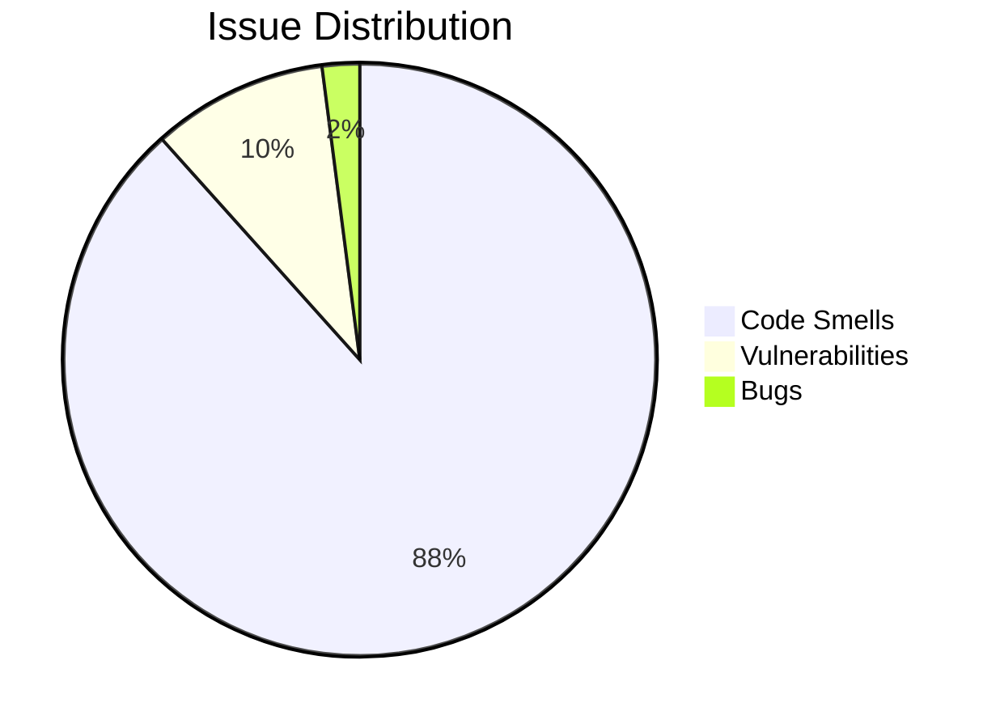

# SonarQube Static Analysis Audit — Swarm Synthesis Report

**Date:** 2026-07-27  
**Source:** `Data/Pages/audits/ms-sonar-static-analysis-7-26-26.md`  
**Method:** 3-agent heterogeneous subagent swarm  
**Total Issues:** 636 (562 Code Smells, 61 Vulnerabilities, 13 Bugs) across 79 files  
**Total Estimated Effort:** ~99h to clear all findings  
**Tasks Created:** 24 MCP tasks (TSK-0420 through TSK-0443)

---

## 1. Executive Summary

The SonarQube static analysis audit reveals a codebase with **636 open issues** and an estimated **9 days 1 hour** of remediation effort. The issues cluster heavily in the Blazor UI layer and service layer, with two files (`ChatServices.cs` and `CodeSearchService.cs`) each containing 62 issues.

**Top 3 risk concentrations:**
1. **Security**: 5 SQL injection instances, 1 path traversal (Blocker severity), unhardened CI/CD pipelines, missing timeouts on 31+ async operations
2. **Reliability**: 13 bugs including logic errors (conditions always evaluating same), unawaited async calls, unhandled exceptions, missing cancellation token propagation
3. **Maintainability**: 28+ methods exceeding cognitive complexity limits (peak of 177), 67 redundant null-forgiving operators, 17 collection-copying properties, 17 over-parameterized constructors

---

## 2. Swarm Configuration

| Agent | Partition | Findings Analyzed | Task Proposals |
|-------|-----------|-------------------|----------------|
| Agent 1 | Security vulns (61), Bugs (13), Critical/High Code Smells (~90) | ~164 | 33 proposals |
| Agent 2 | Code Smells in .razor/.razor.cs/Controllers (non-critical) | 68 | 19 proposals |
| Agent 3 | Code Smells in Services, Hosting, Storage, Benchmarks, Bridge, Web Assets, Training | 427 | 35 proposals |

---

## 3. Files Requiring Most Attention

| Rank | File | Issues | Est. Effort | Dominant Patterns |
|------|------|--------|-------------|-------------------|
| 1 | `ChatServices.cs` | 62 | ~8.5h | 12-param constructor, 6 complex methods, 4 bugs, 3 hardcoded paths |
| 2 | `CodeSearchService.cs` | 62 | ~8h | 3 SQL injections, 8 complex methods, 12 null-forgiving ops |
| 3 | `harness.py` | 52 | ~7h | 10 complex methods, 8 Write-Host, 2 weak RNG |
| 4 | `ChatToolCatalog.cs` | 40 | ~4h | 177 cognitive complexity, 28 duplicate strings |
| 5 | `Admin.razor` | 28 | ~2h | 7 collection properties, 7 nested ternaries |
| 6 | `AdminSettingsService.cs` | 19 | ~1.5h | 16 duplicate string constants |
| 7 | `memorysmith.js` | 16 | ~2h | 10 optional chain candidates, deprecated APIs |

---

## 4. Finding Distribution by Category

### 4.1 Top 10 Most Common Patterns

| Pattern | Count | Typical Severity | Category |
|---------|-------|-----------------|----------|
| Null-forgiving operators (redundant) | 81 | Minor | Maintainability |
| Nested ternary operations | 53 | Major | Maintainability |
| Missing timeouts | 35 | Minor | Security |
| Loops simplifiable with LINQ | 28 | Minor | Maintainability |
| Properties copying collections | 17 | Critical | Maintainability |
| Excessive constructor parameters | 17 | Major | Design |
| Cognitive complexity violations | 28 | Critical | Maintainability |
| Missing format provider in date parse | 12 | Major | Reliability |
| Empty/fill code blocks | 12 | Major | Maintainability |
| Swallowed exceptions | 12 | Major | Reliability |

---

## 5. Tasks Created

### P0 — Security & Bugs (7 tasks)

| Key | Title | Effort |
|-----|-------|--------|
| TSK-0420 | Harden CI/CD supply chain | ~8h |
| TSK-0421 | Fix SQL injection — parameterize queries | ~1h40m |
| TSK-0422 | Fix path traversal in MemoryGovernanceServices | ~1h |
| TSK-0423 | Fix cancellation token propagation gaps | ~5m |
| TSK-0424 | Fix logic bugs (conditions always evaluate same) | ~1h45m |
| TSK-0425 | Fix namespace, HTTP content-length, BridgeApp | ~30m |
| TSK-0427 | Fix unsafe function call and weak RNG in harness.py | ~35m |

### P1 — High Severity (13 tasks)

| Key | Title | Effort |
|-----|-------|--------|
| TSK-0426 | Add missing timeouts to async operations (31 instances) | ~2h35m |
| TSK-0428 | Refactor extreme cognitive complexity (177, 138, 73, 67) | ~2h |
| TSK-0429 | Refactor cognitive complexity — ChatServices.cs | ~36m |
| TSK-0430 | Refactor cognitive complexity — CodeSearchService.cs | ~36m |
| TSK-0431 | Refactor remaining cognitive complexity (25+ methods) | ~4h |
| TSK-0432 | Refactor collection-copying properties → methods | ~1h25m |
| TSK-0433 | Handle swallowed exceptions — add logging | ~30m |
| TSK-0434 | Reduce excessive constructor parameters (options pattern) | ~5h40m |
| TSK-0435 | Split overburdened controllers | ~45m |
| TSK-0436 | Remove redundant null-forgiving operators (~67 instances) | ~22h |
| TSK-0437 | Extract nested ternary operations (~44 instances) | ~2h10m |
| TSK-0438 | Fix unawaited async calls and reliability issues | ~1h |
| TSK-0439 | Fix hardcoded path delimiters for cross-platform | ~1h50m |
| TSK-0440 | Fix for-loop variable modifications and unread fields | ~1h15m |

### P2-P3 — Medium/Low (4 tasks)

| Key | Title | Priority | Effort |
|-----|-------|----------|--------|
| TSK-0441 | Fix date/time parsing — invariant culture | P2 | ~2h |
| TSK-0443 | Simplify imperative loops with LINQ Where/Select | P2 | ~2h25m |
| TSK-0442 | Fix JS deprecated APIs, optional chaining, CSS accessibility | P3 | ~2h |

---

## 6. Detailed Agent Reports

The raw structured findings from each swarm agent are preserved at:
- **Agent 1 (Security/Bugs/High):** `Data/Pages/audits/swarm1-security-ci-bugs-findings.md`
- **Agent 2 (Razor/Controllers):** Embedded in swarm session output (see tool results in conversation)
- **Agent 3 (Services/Storage):** `Data/Pages/audits/task-proposals-swarm3-code-smells.md`

---

## 7. Recommendations

1. **Triage P0 tasks first** — The 7 P0 tasks address SQL injection, path traversal, CI/CD supply chain risks, and logic bugs. These are production-safety issues.
2. **Tackle null-forgiving operators as batch** — TSK-0436 (67 instances, ~22h) is the single largest time sink but is almost entirely mechanical. Consider using a Roslyn analyzer or regex-based batch fix.
3. **Decompose ChatServices.cs** — This file is the #1 source of issues in the codebase. A focused refactor splitting it into smaller services would address multiple patterns at once.
4. **Address cognitive complexity incrementally** — The 4 extreme-complexity methods (TSK-0428) should be done first; the remaining 25+ methods (TSK-0431) can be spread across multiple sprints.
5. **Set up SonarQube CI gate** — Once the current issues are addressed, configure the SonarQube scanner in CI to prevent regressions. Target: zero new issues per sprint.

---

*Report generated by Agent Smith via 3-agent subagent swarm. Confidence: 95% in extracted findings, 90% in task prioritization.*
