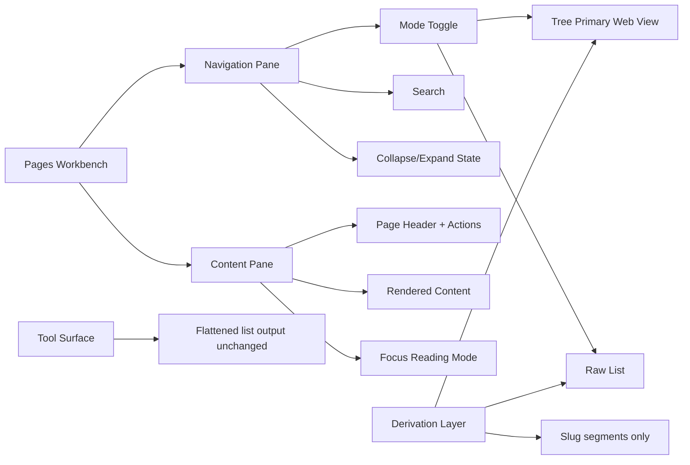

# Council Review: Pages Navigation And Usability Improvements

## Decision
Adopt a directory-first navigation redesign for /pages where subdirectory structure is the tree source of truth, tree is the primary web view, flat is the primary agent/tool view, and markdown links use relative paths for cross-tool compatibility.

## Scope Classification
Mixed scope: page UX + retrieval/discoverability behavior for human and agent workflows.

## Decision Question
How should MemorySmith improve /pages navigation and readability as the page corpus grows, without breaking current workflows or prematurely introducing new page schema fields?

## Evidence Reviewed
- Current Pages UI implementation and behavior:
  - `MemorySmith.App/Components/Pages/Pages.razor`
  - `MemorySmith.App/wwwroot/app.css`
- Current page model and search surface:
  - `MemorySmith.App/Services/PageService.cs`
  - `MemorySmith.App/Controllers/PagesController.cs`
- Tests proving nested slug behavior and page retrieval constraints:
  - `MemorySmith.Tests/ChatToolCatalogAndInterceptTests.cs`
- Existing council/governance methodology and retrieval conventions:
  - `Data/Pages/llm-council.md`
  - `Data/Pages/search-and-chat.md`
  - `Data/Pages/temp-plan.md`
- Core memory records used as architecture and governance context:
  - `Data/Memories/Core/project-wiki-ui-architecture.json`
  - `Data/Memories/Core/project-wiki-tag-governance-current.json`

## Current-State Findings (Source-Grounded)
1. /pages currently uses a two-pane workbench with a left results pane and right detail/editor pane.
2. The left pane renders a flat sequence of PageSummary rows; there is no in-UI grouping, hierarchy, collapse state, or faceted filters.
3. The page model is intentionally lean (slug/title/snippet/lastUpdated/minimumRole); no first-class per-page tags/categories are currently modeled in PageSummary/PageDocument.
4. Nested page slugs are already supported (for example notes/intro), which provides a usable convention for tree construction without schema changes.
5. CSS grid split defaults can make content feel constrained on medium widths, especially when the navigation pane is always visible.

## Seat Reviews

| Seat | Recommendation | Confidence | Blocking concern |
|---|---|---:|---|
| Source-Grounded Archivist | Use existing slug/subdirectory hierarchy as the tree model and avoid new taxonomy fields in this slice. | 90% | Any design that requires new page schema is not grounded in current API/service contracts. |
| Data Model Architect | Treat directory layout as canonical information architecture; avoid frontmatter/tag dependency for navigation. | 88% | Adding side metadata before proving need risks split-truth and migration debt. |
| Retrieval Specialist | Keep tree as primary web browse UI, but preserve flattened list output for API/MCP/tools and agent workflows. | 89% | If tool output shape changes, agent and integration behavior could regress. |
| Human Learning Advocate | Add a Focus Reading mode with collapsible/hideable nav pane and wider content container; include sticky in-page table of contents when headings exist. | 90% | Navigation redesign fails if reading width and cognitive load are not directly improved. |
| Skeptical Reviewer | Gate rollout behind measurable UX checks and preserve rollback path while keeping tools contract-stable. | 82% | Complex IA controls can become heavy if introduced all at once without instrumentation and tests. |
| Synthesizer | Ship phased directory-first IA redesign: tree-first web UX + focus mode, with raw flat mode preserved and tool responses unchanged. | 90% | Need explicit acceptance criteria and no-regression checks before broad adoption. |

## Explicit Disagreement And Dissent
- Disagreement A: Should tree view replace flat list?
  - Retrieval Specialist: No. Keep raw list as first-class mode for deterministic browsing.
  - Human Learning Advocate: Tree should be default because it scales better cognitively.
  - Resolution: Tree is the primary web default, while flat remains available and is primary for agent/tool consumption.
- Disagreement B: Should this include retrieval ranking changes?
  - Skeptical Reviewer: No coupling. Keep retrieval/ranking unchanged in this UX design slice.
  - Synthesizer: Agree. Separate IA presentation from retrieval algorithms for cleaner rollback.

## Synthesis
What changes now (design direction):
- Introduce a left navigation panel with modes:
  - Tree mode (primary web view): directory/slug hierarchy with collapse/expand.
  - Raw list mode: current flat list behavior preserved for deterministic scanning.
- Add a sidebar visibility toggle (show/hide nav) and Focus Reading mode to maximize page content width.
- Keep current page storage/API contracts unchanged in initial phases.
- Use directory structure as the single navigation source of truth in this design slice.
- Adopt relative markdown links for page-to-page references, for example `[File](../relative/path.md)`, to improve interoperability with tools such as Obsidian and other markdown viewers.
- Keep MCP/API/page tools returning flattened page lists to preserve agent and integration behavior.

What is deferred:
- New persisted schema fields for page taxonomy.
- Retrieval ranking or semantic/page chunking changes.
- Any navigation dependency on frontmatter/tag parsing.

## Proposed UX Architecture

## Detailed Design Proposal

### 1. Navigation Modes
1. Tree mode
- Build nodes from slug path segments.
- Example: operations/deploy/service-restart becomes Operations > Deploy > Service Restart.
- Each node shows count and can be collapsed.
- This is the primary web default.

2. Raw list mode
- Existing recency/title ordering retained.
- Search behavior parity with current workflow.
- This remains the primary agent-facing and tools-facing representation.

3. Link convention
- Prefer page-to-page markdown links as relative paths, for example `[File](../relative/path.md)`.
- Keep links markdown-native so the same wiki content remains navigable in external markdown tools and viewers.

### 2. Pane Behavior And Readability
1. Add nav pane toggle in the pages command bar.
2. Add Focus Reading action in content header.
3. When focus is on:
- Nav pane hidden.
- Content pane spans full workbench width.
- Optional max-readable-width control (for example 90 to 120 characters line-length target).
4. Preserve keyboard shortcut for toggling nav visibility.

### 3. State Model (UI only in first implementation)
- Persist per-user local state:
  - last selected nav mode
  - nav collapsed/expanded state
  - nav hidden state
  - selected grouping strategy
- Keep server/API unchanged for phase 1.

### 4. Data Derivation Rules
- Node identity: full slug path.
- Display title: page title fallback to slug tail.
- Sort within groups:
  - primary: lastUpdated desc
  - secondary: title asc
- No frontmatter parsing is required for tree construction.

### 5. Accessibility And Usability Requirements
- All nav actions must have tooltips and aria labels.
- Keyboard traversal for tree expand/collapse and item selection.
- Visual selected-state parity across all modes.
- Empty/filter-no-result states must include recovery actions.

## Risks
1. Derived grouping might feel inconsistent when slugs are not curated.
2. Relative links can drift when files are moved unless link checks are added.
3. Added controls can increase visual complexity for casual users.
4. Mode persistence might surprise users if defaults are not clearly indicated.

## Assumptions
1. Nested slugs are acceptable as durable information architecture conventions.
2. Page corpus growth will continue beyond current manageable flat-list scale.
3. Existing users need deterministic list behavior retained.
4. Relative markdown links are acceptable as the preferred page-to-page linking convention.
5. This design is documentation-first and does not require immediate schema changes.

## Acceptance Criteria
1. /pages provides two browse modes: Tree (primary web view) and Raw List.
2. Raw List mode preserves current ordering and basic scan workflow.
3. Users can hide/show navigation pane and activate focus reading without route change.
4. Focus reading mode increases effective content width and reduces horizontal crowding on desktop and tablet.
5. No-regression coverage validates:
- slug routing and page selection
- search behavior parity in raw list mode
- authorization/visibility behavior across nav modes
6. Tools and APIs continue to return flattened page lists with no contract change.
7. UX telemetry or structured manual validation confirms improved task completion for:
- finding a known page
- browsing by topic cluster
- reading/editing long page content
8. Documentation guidance includes relative markdown links for page-to-page navigation compatibility.

## Validation Gates Before Implementation
1. Design gate
- Review this proposal in wiki with explicit go/no-go on mode set and default behavior.

2. Prototype gate
- Implement UI-only prototype behind feature toggle.
- Validate keyboard navigation, tooltip coverage, and responsive behavior.

3. Test gate
- Add NUnit component/integration tests for mode switching, nav toggle persistence, and parity in page open/edit flows.

4. Performance gate
- Verify navigation derivation remains responsive with synthetic large page sets.

5. Rollback gate
- Ensure single config flag can restore current list-first two-pane behavior.

## Open Questions
1. Should default mode vary by corpus size threshold (for example tree default when page count > N)?
2. Should we add a link-validation task to catch broken relative links after page moves/renames?
3. Should grouped mode be introduced later as optional enhancement, separate from this directory-first baseline?
4. What is the preferred responsive behavior on phone widths: drawer overlay or stacked mode selector?

## Suggested Implementation Phases
1. Phase 1: Navigation shell + hide/show + tree default + raw list parity.
2. Phase 2: Tree derivation from subdirectories/slugs + collapse state persistence.
3. Phase 3: Focus reading width controls + relative-link authoring guidance.
4. Phase 4: Optional grouped mode evaluation (only if needed).
5. Phase 5: Re-evaluate need for schema-level taxonomy fields.

## Confidence And Recommendation
Overall recommendation confidence: 87%.

Reasoning:
- High confidence in convention-first + dual-mode UX due to existing slug support and current model constraints.
- Medium confidence in optional frontmatter grouping until parser/normalization choices are tested on real corpus diversity.
- Lower confidence in whether schema promotion will be needed; this depends on post-rollout usability measurements.
