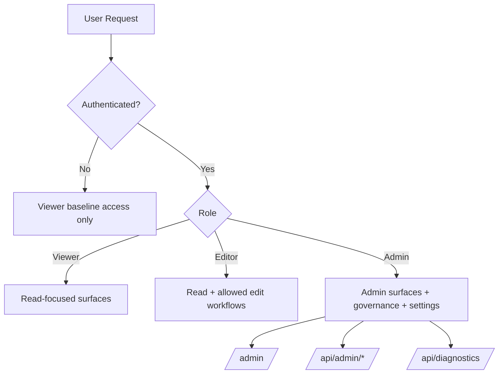

# Admin and Authentication

Visibility: this page is intentionally Admin-only.

The admin and authentication features cover local sign-in, role-based access control, provider management, audit visibility, and operational settings.

## Access Model

> [!NOTE]
> Screenshot placeholder [FEAT-ADMIN-01]: `/admin/setup` first-admin bootstrap page.

## What It Does

- Provides first-admin bootstrap through `/admin/setup`.
- Supports local login plus the currently wired external-provider flow at `/login` and `/profile`.
- Enforces role-based access for UI, API, and MCP actions.
- Exposes admin controls for users, providers, settings, audit, and history.

## Why It Matters

MemorySmith needs local-first convenience without losing governance. Admin and auth controls protect write paths, diagnostics, and sensitive operations.

## Key Capabilities

- Roles: Viewer, Editor, Admin.
- Local password authentication, GitHub external sign-in, and provider administration.
- Admin-only views for settings, audit, and change history.
- Compatibility path for first-run local editing before first admin exists.

## Current Operator Notes

- `/admin` Configuration edits allowlisted scalar and list settings through `AdminSettingsService`. Sensitive values stay write-only, show `Configured` or `Not configured`, and provide an explicit `Clear secret` action rather than echoing stored secrets.
- `/admin` keeps the active admin section visible outside the scrollable tab strip and renders Audit/History rows as labeled stacked cells on narrow screens so operators can still scan targets, artifacts, and copy actions without decoding a dense desktop table.
- Admin audit and history views are the operator surface for auth and mutation evidence. Persisted entries carry request IDs and privacy-reviewed request metadata hashes without storing raw IP or user-agent values.
- GitHub external-auth callbacks now use the same durable evidence contract as local password sign-in: successful callbacks write `auth.login.succeeded` plus login history, and callback failures write `auth.login.failed` plus a failure login-history row before redirecting back to `/login` or `/profile`.
- External provider runtime is partial today: GitHub is wired into the startup auth pipeline. Google and Microsoft can still be preconfigured for future use, but `/admin` marks them `Unsupported` and `/login` plus `/profile` do not treat them as active sign-in methods until matching auth handlers are registered.

> [!NOTE]
> Screenshot placeholder [FEAT-ADMIN-02]: `/admin` settings and role-management surface.
> [!NOTE]
> Screenshot placeholder [FEAT-ADMIN-03]: `/login` with provider/local auth options.
> [!NOTE]
> Screenshot placeholder [FEAT-ADMIN-04]: audit/history visibility in admin workflows.

## Related Pages

- [Proposals and Governance](proposals-and-governance.md)
- [Health and Diagnostics](health-and-diagnostics.md)
- [Architecture](../guides/architecture.md)

## Screenshot Backlog Template

- [ ] FEAT-ADMIN-01 admin setup bootstrap
- [ ] FEAT-ADMIN-02 admin settings and role management
- [ ] FEAT-ADMIN-03 login and auth options
- [ ] FEAT-ADMIN-04 audit/history admin view
