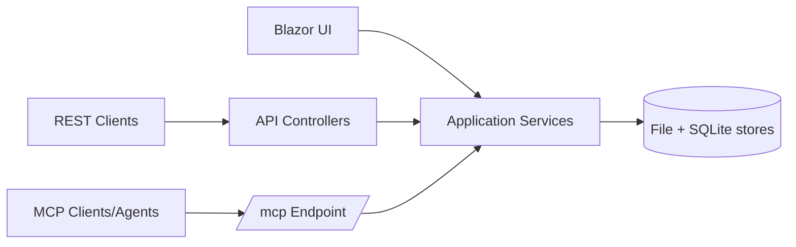

# API and MCP Integration

MemorySmith exposes both REST APIs and an MCP endpoint so local automation and AI tools can use the same data and service layer as the UI.

## Integration Flow

> [!NOTE]
> Screenshot placeholder [FEAT-API-01]: API route explorer view showing major `/api/*` surfaces.

## What It Does

- Provides REST routes for memories, pages, search, chat, auth, admin, stats, and diagnostics.
- Exposes MCP tools at `/mcp` for memory and page retrieval workflows.
- Reuses shared application services to avoid UI and API behavior drift.
- Applies role and policy checks consistently across surfaces.

## Why It Matters

This feature makes MemorySmith usable by scripts, local tools, and AI agents without creating a separate backend product.

## Key Capabilities

- Unified search and retrieval surfaces across memories and pages.
- Context-pack and source-bundle support for evidence-driven workflows.
- Edit-gated page save and delete MCP operations.
- Local-first operational defaults with optional API hardening controls.

## MCP Authorization Contract

| Tool family | Contract |
| --- | --- |
| Memory search, semantic, hybrid, context-pack, and get | Requires the caller to satisfy the MemorySmith view policy. |
| Page search, page get, and unified page results | Requires view access and filters by page minimum visibility: Anonymous, Authenticated, or Admin. |
| Page save and delete | Requires edit permission; Admin-only page visibility remains limited to Admin callers. |
| Source bundle and find-by-source | Requires the source-bundle policy because resolved source links may include local file content. These tools are MCP-only, not chat-requested model tools. Editor and Admin callers satisfy this policy; configured API-key requests and auth-disabled local installs also satisfy it. Viewer callers, including the default anonymous Viewer role, do not. |

For external agents, use `memorysmith_context_pack` to narrow evidence before calling `memorysmith_source_bundle`. Treat missing page hits or source entries as a possible permission/filtering outcome, not only as absent content.

> [!NOTE]
> Screenshot placeholder [FEAT-API-02]: MCP tool list and endpoint details.
> [!NOTE]
> Screenshot placeholder [FEAT-API-03]: `/api/health/readiness` successful response example.
> [!NOTE]
> Screenshot placeholder [FEAT-API-04]: example unified search API response payload.

## Related Pages

- [Search System](search-system.md)
- [Variables and Source Links](variables-and-source-links.md)
- [Search and Chat](../guides/search-and-chat.md)

## Screenshot Backlog Template

- [ ] FEAT-API-01 API surface explorer
- [ ] FEAT-API-02 MCP tools and endpoint details
- [ ] FEAT-API-03 health readiness API response
- [ ] FEAT-API-04 unified search API response sample
