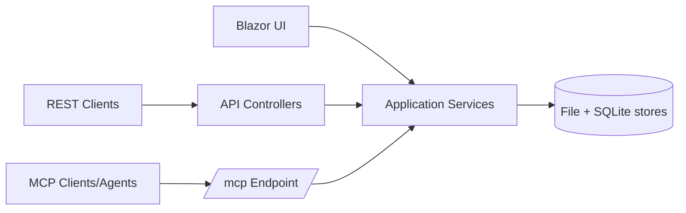

# API and MCP Integration

MemorySmith exposes both REST APIs and an MCP endpoint so local automation and AI tools can use the same data and service layer as the UI.

## Integration Flow

> [!NOTE]
> Screenshot placeholder [FEAT-API-01]: API route explorer view showing major `/api/*` surfaces.

## What It Does

- Provides REST routes for memories, pages, search, chat, auth, admin, stats, and diagnostics.
- Exposes MCP tools at `/mcp` for memory and page retrieval workflows.
- Reuses shared application services to avoid UI and API behavior drift.
- Applies role and policy checks consistently across surfaces.

## Why It Matters

This feature makes MemorySmith usable by scripts, local tools, and AI agents without creating a separate backend product.

## Key Capabilities

- Unified search and retrieval surfaces across memories and pages.
- Context-pack and source-bundle support for evidence-driven workflows.
- Agent task tools for listing, reading, creating, updating, status changes, comments, and attachments.
- Edit-gated page save and delete MCP operations.
- Per-tool MCP enable/disable configuration for local deployment risk controls.
- Local-first operational defaults with optional API hardening controls.

## Search Contract

MemorySmith search APIs and MCP tools accept plain text plus explicit filters. They do not expose a full Lucene query-parser language.

- `query` is plain text. The lexical path uses `StandardAnalyzer` tokenization and weighted field scoring; semantic fallback uses token overlap plus aliases and phrase boosts.
- `tags` is a comma-separated, case-insensitive exact-match filter with any-match semantics. Namespaced tags such as `kind:rule`, `audience:agent`, and `scope:configuration` are literal tag values, not operators.
- `status` is an optional memory status filter: `Unconsolidated`, `Working`, `Core`, or `Deprecated`.
- Empty query returns recency ordering rather than parse errors.
- Do not rely on fielded, boolean, wildcard, fuzzy, or date-range syntax such as `title:mcp`, `foo AND bar`, `auth*`, or `updated:[2026 TO *]`.

## Structured Search Output

| Surface | Structured options | Notes |
| --- | --- | --- |
| `POST /api/memories/search*` | `format=envelope`, `format=json-v2` | Returns `memorysmith.retrieval-results.v1`. Default remains the compatible result array. |
| `GET /api/pages` | `format=json`, `format=envelope`, `format=json-v2` | Returns `memorysmith.page-results.v1` for list/search responses. |
| `memorysmith_search`, `memorysmith_semantic_search`, `memorysmith_hybrid_search` | `format=json`, `format=envelope` | Both currently return the same structured retrieval envelope. |
| `memorysmith_context_pack` | `format=json` | Returns `memorysmith.context-pack.v1`. |
| `memorysmith_unified_search` | `format=json`, `format=envelope` | Returns `memorysmith.unified-search.v1`. |

Score contract:

- Lexical and semantic numeric scores are mode-specific ranking signals.
- Hybrid `Score` is Reciprocal Rank Fusion and should not be interpreted as confidence.
- Public MCP docs should use the advertised format values `markdown`, `json`, and `envelope`. The current parser also accepts `json-v2` as a compatibility alias for structured retrieval, but that alias is not the primary MCP contract.

## MCP Authorization Contract

| Tool family | Contract |
| --- | --- |
| Memory search, semantic, hybrid, context-pack, and get | Requires the caller to satisfy the MemorySmith view policy. |
| Page search, page get, and unified page results | Requires view access and filters by page minimum visibility: Anonymous, Authenticated, or Admin. |
| Task list and get | Requires view access and returns task summaries/full records from the same task service used by `/tasks` and `/api/tasks`. |
| Task create, update, status, comment, and attachment tools | Requires edit permission and reuses task-service validation, persistence, and activity-history writes. |
| Page save and delete | Requires edit permission; Admin-only page visibility remains limited to Admin callers. |
| Source bundle and find-by-source | Requires the source-bundle policy because resolved source links may include local file content. These tools are MCP-only, not chat-requested model tools. Editor and Admin callers satisfy this policy; configured API-key requests and auth-disabled local installs also satisfy it. Viewer callers, including the default anonymous Viewer role, do not. |

`MemorySmith:Mcp:DisabledTools` removes named tools from MCP discovery and direct execution; `MemorySmith:Mcp:EnabledTools` opts in descriptor-level default-off tools. Disabled wins if both lists name the same tool.

For external agents, use `memorysmith_context_pack` to narrow evidence before calling `memorysmith_source_bundle`. Treat missing page hits or source entries as a possible permission/filtering outcome, not only as absent content.

For the full search format matrix and concrete examples, use [Search and Chat](../guides/search-and-chat.md). For the search-engine behavior itself, use [Search System](search-system.md).

> [!NOTE]
> Screenshot placeholder [FEAT-API-02]: MCP tool list and endpoint details.
> [!NOTE]
> Screenshot placeholder [FEAT-API-03]: `/api/health/readiness` successful response example.
> [!NOTE]
> Screenshot placeholder [FEAT-API-04]: example unified search API response payload.

## Related Pages

- [Search System](search-system.md)
- [Variables and Source Links](variables-and-source-links.md)
- [Search and Chat](../guides/search-and-chat.md)

## Screenshot Backlog Template

- [ ] FEAT-API-01 API surface explorer
- [ ] FEAT-API-02 MCP tools and endpoint details
- [ ] FEAT-API-03 health readiness API response
- [ ] FEAT-API-04 unified search API response sample
