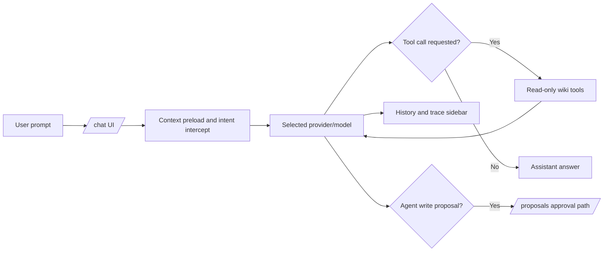

# Chat and Agent

The Chat and Agent surface at `/chat` supports memory-enhanced chat and controlled agent workflows in one interface.

## Chat And Agent Runtime Flow

> [!NOTE]
> Screenshot placeholder [FEAT-CHAT-01]: `/chat` page with provider/model selector and prompt composer.

## What It Does

- Runs chat with provider and model selection.
- Streams responses with trace and references support.
- Allows read-only tool-assisted retrieval during chat turns.
- Supports optional agent write proposals with explicit approvals.

## Why It Matters

Chat provides fast question answering over local project knowledge. Agent mode introduces structured, approval-gated change proposals without bypassing governance controls.

## Key Capabilities

- Context-aware preloading for MemorySmith-specific prompts.
- Tool interception and tool-call loops with bounded limits.
- Attachments support for text and images.
- Shared right sidebar for history and execution trace.
- Proposal-first write flow when agent writes are enabled.

> [!NOTE]
> Screenshot placeholder [FEAT-CHAT-02]: chat response with references drawer expanded.
> [!NOTE]
> Screenshot placeholder [FEAT-CHAT-03]: trace sidebar showing tool call and latency details.
> [!NOTE]
> Screenshot placeholder [FEAT-CHAT-04]: agent write proposal pending approval state.

## Safety And Governance

- Tool execution is read-only by default.
- Agent writes require explicit feature enablement and sufficient role.
- UI approval is required before write proposals are applied.

> [!NOTE]
> Screenshot placeholder [FEAT-CHAT-05]: mode/capability indicators showing read-only tools vs write-approval controls.

## Related Pages

- [Search System](search-system.md)
- [Proposals and Governance](proposals-and-governance.md)
- [Search and Chat](../guides/search-and-chat.md)

## Screenshot Backlog Template

- [ ] FEAT-CHAT-01 chat surface with provider/model selector
- [ ] FEAT-CHAT-02 response with references drawer
- [ ] FEAT-CHAT-03 trace sidebar tool execution details
- [ ] FEAT-CHAT-04 pending agent write proposal
- [ ] FEAT-CHAT-05 capability indicators and governance controls
