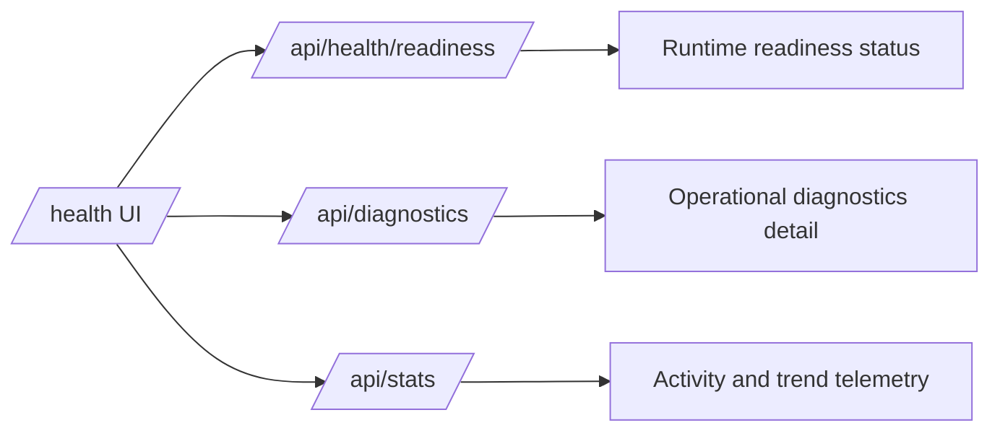

# Health and Diagnostics

The health and diagnostics feature set gives runtime visibility into readiness, activity, maintenance state, and operational configuration.

## Observability Flow

> [!NOTE]
> Screenshot placeholder [FEAT-HEALTH-01]: `/health` dashboard overview with status cards.

## What It Does

- Serves a health dashboard at `/health`.
- Provides readiness and diagnostics APIs for local operations.
- Reports search and maintenance telemetry for troubleshooting.
- Surfaces operational state for audit and support workflows.

## Why It Matters

Local-first systems still need clear observability. Health and diagnostics help confirm that storage paths, search providers, and background jobs are working as expected.

## Key Capabilities

- Runtime status cards and activity charting.
- Diagnostic endpoint coverage for local triage.
- Visibility into indexing and maintenance behavior.
- Role-gated access to sensitive operational data.

> [!NOTE]
> Screenshot placeholder [FEAT-HEALTH-02]: activity charts and maintenance telemetry section.
> [!NOTE]
> Screenshot placeholder [FEAT-HEALTH-03]: `/api/health/readiness` response example.
> [!NOTE]
> Screenshot placeholder [FEAT-HEALTH-04]: diagnostics endpoint example with redacted sensitive fields.

## Related Pages

- [Admin and Authentication](admin-and-auth.md)
- [Search System](search-system.md)
- [Architecture](../guides/architecture.md)

## Screenshot Backlog Template

- [ ] FEAT-HEALTH-01 health dashboard overview
- [ ] FEAT-HEALTH-02 activity and maintenance telemetry
- [ ] FEAT-HEALTH-03 readiness API response
- [ ] FEAT-HEALTH-04 diagnostics API response (redacted)
