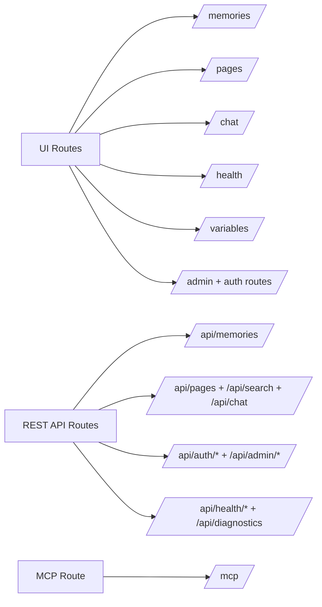

# Feature Route Map

This route map links key routes to the feature pages in this section.

## Route Topology

> [!NOTE]
> Screenshot placeholder [FEAT-ROUTE-01]: route map overview in the app navigation context.

## UI Routes

| Route | Feature | Primary Audience | Notes |
| --- | --- | --- | --- |
| `/memories` | [Memories Workbench](memories-workbench.md) | Viewer, Editor, Admin | Structured memory browse/search/edit surface. |
| `/pages` | [Markdown Pages Wiki](markdown-pages-wiki.md) | Viewer, Editor, Admin | Markdown wiki read/write surface. |
| `/chat` | [Chat and Agent](chat-and-agent.md) | Viewer, Editor, Admin | Context-aware chat and optional agent mode. |
| `/proposals` | [Proposals and Governance](proposals-and-governance.md) | Admin | Proposal review and governance workflows. |
| `/login`, `/profile`, `/admin/setup`, `/admin` | [Admin and Authentication](admin-and-auth.md) | Viewer, Admin | Admin setup and auth governance workflows. |
| `/health` | [Health and Diagnostics](health-and-diagnostics.md) | Viewer, Editor, Admin | Runtime status and operational telemetry. |
| `/variables` | [Variables and Source Links](variables-and-source-links.md) | Editor, Admin | Variable management for source-link expansion. |

## API And Tool Routes

| Route | Feature | Primary Audience | Notes |
| --- | --- | --- | --- |
| `/api/memories` | [API and MCP Integration](api-and-mcp.md) | Automation, Admin | Memory CRUD and related automation workflows. |
| `/api/pages`, `/api/search`, `/api/chat` | [API and MCP Integration](api-and-mcp.md) | Automation, Admin | Page/search/chat API surfaces. |
| `/api/auth/*`, `/api/admin/*` | [Admin and Authentication](admin-and-auth.md) | Admin | Auth and admin governance APIs. |
| `/api/stats`, `/api/health/*`, `/api/diagnostics` | [Health and Diagnostics](health-and-diagnostics.md) | Admin | Operational status and diagnostics APIs. |
| `/mcp` | [API and MCP Integration](api-and-mcp.md) | Automation, Admin | MCP JSON-RPC endpoint for tool-based retrieval. |

> [!NOTE]
> Screenshot placeholder [FEAT-ROUTE-02]: `/health` route and diagnostics links as seen in navigation.
> [!NOTE]
> Screenshot placeholder [FEAT-ROUTE-03]: `/variables` route page with source-link variable table.

## Scope Note

Tasks routes are intentionally excluded from this map while the Tasks surface is under active design and implementation.

## Screenshot Backlog Template

- [ ] FEAT-ROUTE-01 route map overview context
- [ ] FEAT-ROUTE-02 health and diagnostics route example
- [ ] FEAT-ROUTE-03 variables route example
