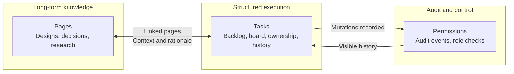
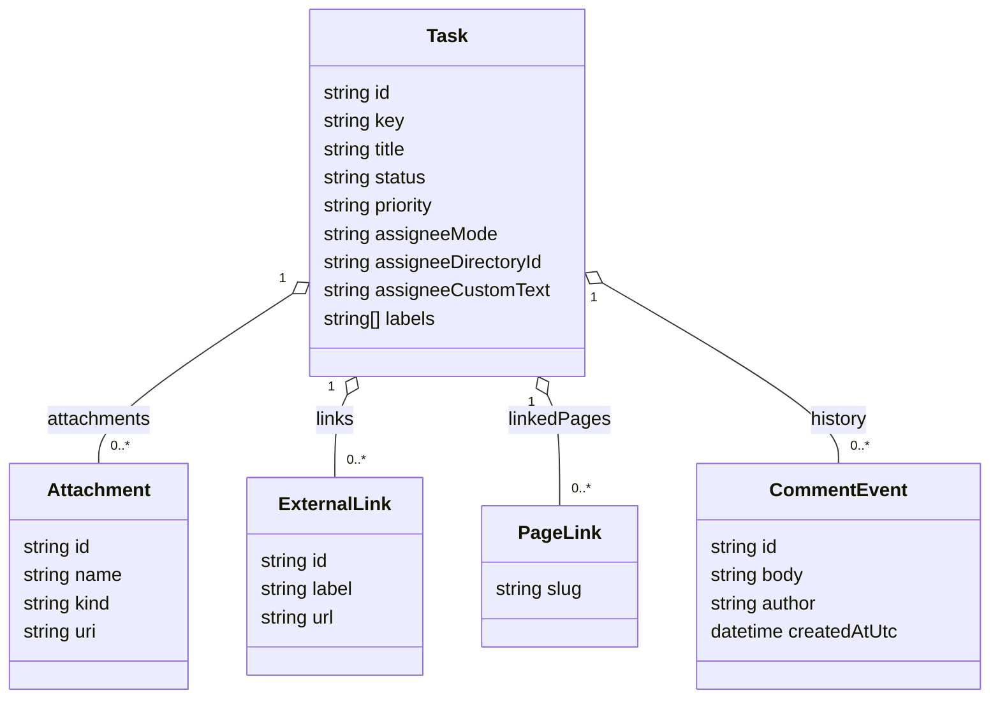

# Feature Design: Tasks Page (Jira-like Planning Surface)

Status: design proposal with partial implementation, 2026-05-23

Scope: planning/design only. This document does not imply implementation is complete.

Implementation status note (2026-05-23):

- Implemented: first-class site route `/tasks` via `MemorySmith.App/Components/Pages/Tasks.razor`.
- Implemented: nav entry in `MemorySmith.App/Components/Layout/NavMenu.razor`.
- Implemented: contract coverage for `/tasks` route in `MemorySmith.Tests/AppApiContractTests.cs`.
- Not yet implemented: full structured tasks domain (`Data/Tasks`, task APIs, board editing workflow).

Related:

- [Future Tasks](../workbench/tasks.md)
- [UI Architecture Current State](../../Memories/Core/project-wiki-ui-architecture.json)
- [Markdown Pages Current State](../../Memories/Core/project-wiki-markdown-pages.json)
- [MemorySmith final refactor design](../../../MemorySmith.Core/Docs/Plans/MemorySmith_FinalRefactorDesign_20260507.md)

## 1. Summary

MemorySmith should add a first-class Tasks page that tracks future goals with Jira-like workflow while keeping pages as the long-form Atlassian-style knowledge base.

At a glance:

| Area | Tasks Page Role | Existing Surface |
| --- | --- | --- |
| Planning | Backlog, board, ownership, priorities, due dates | `Data/Pages/tasks.md` |
| Context | Attachments, links, comments, linked wiki pages | Pages and markdown docs |
| Governance | Audit trail, role-aware edits, status changes | Existing auth/audit stack |
| Narrative | Long-form design, research, and decisions | Pages |

Design direction:

- tasks are structured work items with status/priority/ownership and board/list views;
- each task can link to one or more wiki pages for rich context, notes, and decision history;
- each task can carry attachments, external links, and comments as part of its history trail;
- task state is durable, auditable, and role-aware;
- implementation remains consistent with the existing single-host, file-first MemorySmith architecture.

This gives the team a practical execution surface (Tasks) without replacing narrative documentation (Pages).



## 2. Problem Statement

Current state:

- [Future Tasks](../workbench/tasks.md) is a single markdown checklist.
- It is good for lightweight notes but weak for:

  - filtering by owner, status, type, and priority;
  - tracking lifecycle changes over time;
  - splitting one initiative into multiple linked tasks;
  - planning and reviewing work in a board view;
  - auditing who changed what and when.

Resulting friction:

- planning and execution are mixed into one page and become harder to query;
- high-volume work becomes difficult to triage;
- chat/agent flows have no structured task contract to reference.

## 3. Goals

1. Add a Jira-like task tracker inside MemorySmith that remains local-first and repository-friendly.
2. Keep Pages as the canonical long-form wiki and link Tasks to those pages.
3. Support backlog and near-term planning with list and board workflows.
4. Provide clear auditability and role-based permissions for task mutations.
5. Keep the first version implementation-bounded: useful immediately, extensible later.

## 4. Non-Goals (V1)

1. No external Atlassian/Jira sync in V1.
2. No advanced sprint velocity forecasting in V1.
3. No full dependency graph engine in V1.
4. No custom workflow designer in V1 (use fixed default statuses).
5. No replacement of Proposals workflow; Proposals remains separate governance for agent/file diffs.

## 5. User Experience Design

Route:

- /tasks

Primary views:

1. Backlog/List view

- Dense table/list with filters: status, type, priority, assignee, label, epic, text query.
- Multi-sort: Updated desc default; optional Priority then DueDate.

1. Board view (Kanban)

- Columns: Backlog, Ready, In Progress, Blocked, Done.
- Drag-and-drop card movement between columns (mouse + keyboard fallbacks).
- Cards show key, title, priority, assignee, labels, due date, linked page count.

1. Task detail pane

- Right-side detail panel similar to existing workbench style.
- Editable fields with save/cancel controls.
- Timeline of status changes and comments.
- Attachment section with upload, preview, download, and remove actions.
- Link section for external URLs and related wiki pages.
- Linked pages section with open/create quick actions.

1. Quick create

- Minimal commandbar create: title + type, defaults to Backlog.
- Optional Create linked page checkbox.

Navigation

- Add Tasks nav item near Pages/Chat for all users who can view.

Accessibility and affordance

- Icon-based row actions with tooltips (consistent with existing UI preference).
- Full keyboard path for open/edit/status change.
- Distinct status/priority badges with text + color (not color-only meaning).

## 6. Information Architecture

Concept model:

- Epic: broad initiative (optional parent item).
- Task: actionable work unit.
- Subtask: optional child item (same schema, parent reference).
- Page link: relationship from task to markdown wiki page(s).



Relationship to Pages:

- Pages hold narrative detail (architecture, research, runbooks, meeting notes).
- Tasks hold operational execution metadata.
- Task detail provides direct links to related page slugs.

Recommended conventions:

- one primary page per epic/task for deep context;
- optional additional supporting pages;
- keep task title concise, move long rationale into linked page.

## 7. Data Model (Proposed V1)

Storage root:

- Data/Tasks

Record format:

- JSON files, one task per file, mirroring existing file-backed design principles.

Task key format:

- TSK-0001 style human key + stable internal id.

Suggested schema:

```json
{
  "id": "tsk-0001-build-tasks-page-v1",
  "key": "TSK-0001",
  "title": "Build Tasks page V1",
  "description": "Implement list and board views with role-aware mutation endpoints.",
  "type": "Task",
  "status": "Backlog",
  "priority": "High",
  "assigneeMode": "Directory",
  "assignee": "local-admin",
  "assigneeDirectoryId": "u-local-admin",
  "assigneeCustomText": null,
  "reporter": "local-admin",
  "labels": ["ui", "planning"],
  "attachments": [
    {
      "id": "att-0001",
      "name": "tasks-wireframe.png",
      "kind": "file",
      "uri": "Data/Tasks/assets/tasks-wireframe.png",
      "addedAtUtc": "2026-05-23T00:00:00Z"
    }
  ],
  "externalLinks": [
    {
      "id": "link-0001",
      "label": "Design reference",
      "url": "https://example.com/spec",
      "addedAtUtc": "2026-05-23T00:00:00Z"
    }
  ],
  "epicId": null,
  "parentId": null,
  "linkedPages": ["plans/tasks-page-feature-design-20260523"],
  "references": ["project-wiki-ui-architecture"],
  "dueDateUtc": null,
  "createdAtUtc": "2026-05-23T00:00:00Z",
  "updatedAtUtc": "2026-05-23T00:00:00Z",
  "completedAtUtc": null,
  "revision": 1
}
```

Assignee model (V1):

- Primary assignment path uses a dictionary-backed directory value selected from known users.
- Optional fallback allows custom free-text assignee when a directory entry does not exist yet.
- When custom text is used, store `assigneeMode = "Custom"`, keep `assigneeDirectoryId = null`, and persist `assigneeCustomText`.
- UI should visually distinguish directory vs custom assignments to reduce ambiguity in filtering and reporting.

Companion activity log:

- Data/Events/tasks.activity.jsonl
- Append-only event stream for status changes, edits, comments, attachments, and links.
- Comments are stored as history events and surfaced in the task timeline; the latest comment can be summarized in the task snapshot if helpful for list views.

Optional metadata sidecar:

- Data/Tasks/.config/workflow.json for allowed statuses/types/priorities.

## 8. API Surface (Proposed)

Controller:

- /api/tasks

Endpoints:

1. GET /api/tasks

- Query/filter/search/sort/paging.

1. GET /api/tasks/{idOrKey}

- Full task document + recent activity.

1. POST /api/tasks

- Create task.

- Validate assignee inputs: exactly one of `assigneeDirectoryId` or `assigneeCustomText` is active based on `assigneeMode`.

1. PUT /api/tasks/{idOrKey}

- Update editable fields.

- Preserve assignee validation and reject mixed/invalid assignee payloads.

1. POST /api/tasks/{idOrKey}/status

- Targeted status transition endpoint.

1. POST /api/tasks/{idOrKey}/comments

- Add comment event.
- Preserve comment history as append-only records.

1. POST /api/tasks/{idOrKey}/links/pages

- Link existing page slug or create-and-link page.

1. POST /api/tasks/{idOrKey}/links/external

- Add an external URL link with a label.

1. POST /api/tasks/{idOrKey}/attachments

- Add an uploaded file attachment or register a trusted file reference.

1. DELETE /api/tasks/{idOrKey}/attachments/{attachmentId}

- Remove an attachment reference from the task.

1. DELETE /api/tasks/{idOrKey}

- Soft delete/archive in V1 (preferred), hard delete optional admin-only.

Envelope support:

- mirror existing retrieval envelope pattern where useful for chat/tool interoperability.

## 9. RBAC and Security

Read access:

- same baseline as Pages visibility for authenticated/read roles.

Mutation:

- Editor and Admin can create/update tasks.
- Admin-only actions:

  - workflow config changes;
  - hard delete/purge;
  - global task settings.

Safety controls:

- sanitize/validate IDs, slugs, labels.
- reject path traversal and invalid linked page slugs.
- enforce bounded text lengths for title/description/comments.
- enforce assignee-mode contract (`Directory` or `Custom`) with mutually exclusive fields.
- validate attachment size, path, and MIME type before persistence or reference registration.
- validate external links as well-formed URLs and reject unsafe schemes.

Auditability:

- all mutations emit task activity events and integrate with existing audit/history surfaces where practical.

## 10. UI Component Sketch (Blazor/MudBlazor)

New page/component:

- MemorySmith.App/Components/Pages/Tasks.razor

Likely supporting components:

- Components/Tasks/TaskBoard.razor
- Components/Tasks/TaskList.razor
- Components/Tasks/TaskDetailPanel.razor
- Components/Tasks/TaskEditorDialog.razor

Services:

- MemorySmith.App/Services/ITaskService.cs
- MemorySmith.App/Services/FileTaskService.cs
- MemorySmith.App/Services/TaskActivityService.cs

Navigation:

- update Components/Layout/NavMenu.razor with Tasks link.

Styling:

- reuse wiki-workbench layout classes from Memories/Pages/Proposals for consistency.

## 11. Migration Strategy

Input source:

- existing checklist in [Future Tasks](../workbench/tasks.md).

Migration approach:

1. parse markdown checklist lines into draft tasks;
2. map checked items to Done, unchecked to Backlog;
3. preserve original bullet text in description;
4. write imported tasks with source marker label imported-from-tasks-md;
5. keep tasks.md as human-readable summary page with links to /tasks filters.

Migration assignee defaults:

- Imported checklist items default to `assigneeMode = "Custom"` with `assigneeCustomText = "unassigned"`.
- Directory assignment can be applied later through bulk edit or per-task edit.

Fallback:

- if import confidence is low for a line, keep it only in tasks.md and emit import warning.

## 12. Delivery Plan

Phase 1: foundation

1. Task schema + file store + validation.
2. Basic API CRUD and status transition.
3. Basic /tasks list + detail pane.

Phase 2: productivity

1. Board view with status columns.
2. Filters, search, sorting, saved filter presets.
3. Linked page create/link actions.

Phase 3: governance and polish

1. Event timeline and audit integration.
2. Import helper from tasks.md.
3. Performance tuning and UX polish.

## 13. Testing Strategy (NUnit)

Unit tests:

- key generation, schema validation, transition rules, slug/link validation.
- assignee validation matrix: directory-only valid, custom-only valid, mixed invalid, missing invalid.
- attachment and external-link validation, plus comment-history event ordering.

Integration tests:

- /api/tasks CRUD + transition endpoints.
- RBAC behavior by role.
- activity log emission.
- attachment add/remove and external link add flows.

UI tests (existing PagesAndChat style)

- route render /tasks;
- list/detail interactions;
- board drag/drop transition behavior;
- linked page actions and navigation.

Regression checks:

- no breakage to existing /pages, /proposals, /chat routes.

## 14. Risks and Mitigations

1. Scope creep toward full project management suite

- Mitigation: fixed V1 scope and explicit non-goals.

1. Duplicate truth between tasks and pages

- Mitigation: clear contract: task metadata in Tasks, narrative in Pages.

1. Workflow rigidity

- Mitigation: ship fixed statuses first, then optional config file.

1. Overloading Proposals conceptually

- Mitigation: keep Proposals as agent write governance; Tasks as planning tracker.

## 15. Open Questions

1. Should assignee be free-text in V1, or constrained to local users from auth store?
1. Should attachment storage use file copies only, or also allow trusted references to existing files?
1. Should task comments live only in activity log, or also in task record snapshot?
1. Should Done tasks auto-archive after N days?
1. Should linked pages support one-click scaffold templates (design, runbook, decision)?
1. Should task records participate in MCP read tools in V1 or V2?

## 16. Acceptance Criteria (Design Complete)

1. A dedicated /tasks route exists in design and is consistent with MemorySmith UI architecture.
2. Structured task schema and file storage path are specified.
3. API, RBAC, migration, and testing strategy are defined.
4. Relationship between Tasks and Pages is explicit and non-conflicting.
5. Implementation phases are small enough to execute incrementally.

## 17. Confidence and Assumptions

Confidence: 88%

Assumptions:

1. MemorySmith will remain single-host and file-first for this feature slice.
2. Existing role policies (Viewer/Editor/Admin) continue to govern UI/API access.
3. Task tracking should integrate with, not replace, current Pages and Proposals surfaces.

If these assumptions change, the highest-impact redesign area is data storage and permissions.
