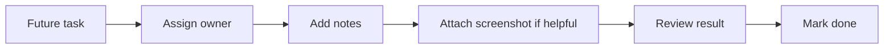

# Future Tasks

This page tracks user-facing work in plain language. Completed items stay here as a lightweight product history; open items should describe the outcome a person would notice, not only the internal implementation detail.

> Current task state lives in `/tasks` and the JSON records under `Data/Tasks`. This page is a human-readable seed list and product-history view; verify status, owner, comments, and acceptance criteria against the task records before planning implementation.

## How To Use This Page

- Keep the visible owner on each future task so dogfood is obvious.
- Use `Copilot` for tasks that should be handed to the agent first.
- Put notes in the Notes column instead of hiding them in the task text.
- Add screenshot links or page assets in the Screenshot column when a visual check matters.

## Current Priorities

| Status | Owner | Task | Notes | Screenshot |
| --- | --- | --- | --- | --- |
| Backlog | Copilot | Vars.json should not be a loose file | Add validation so the variable store behaves like a managed config surface, not an ad hoc file. | Pending |
| Done | Copilot | Make Proposals proposal-first by collapsing maintenance run context | `/proposals` now keeps filters and proposal triage visible by default, moves run controls plus recent activity into a secondary `Maintenance context` drawer, and auto-collapses that drawer when a proposal is selected so the selected detail keeps first-viewport priority. | `artifacts/browser-validation/tsk-0126/` |
| Done | Copilot | Improve proposal detail review layout and disabled action explanations | `/proposals` now gives the selected proposal a dedicated review-state block, constrains the narrow proposal list so summary/state stay in the first viewport, and explains disabled review actions with tooltip-backed reasons across needs-revision, approved, and rejected states. | `artifacts/browser-validation/tsk-0132/` |
| Done | Copilot | Improve selected Task detail density and edit form hierarchy | `/tasks` now gives the selected task a dedicated summary block, a discoverable focus-detail toggle, and separate read/edit sections so narrow selected-task review no longer crowds metadata, labels, and actions together. | `artifacts/browser-validation/tsk-0131/` |
| Done | Copilot | Tighten Maintenance workbench responsive spacing and scroll affordances | `/maintenance` now uses clearer scroll bodies for trace/action/transcript history, wraps long proposal ids with tooltip-backed links, and preserves readable chat controls on narrow screens. | `artifacts/browser-validation/tsk-0121/` |
| Done | Copilot | Restructure Admin Configuration for category navigation and dirty state | `/admin` Configuration now surfaces category-jump buttons, dirty counts, a changed-only filter, and responsive labeled setting rows so operators can narrow and review pending changes without scanning the entire settings catalog. | `artifacts/browser-validation/tsk-0139/` |
| Done | Copilot | Make Admin users and tabs responsive and privacy-conscious | `/admin` now keeps section context visible while the Users tab renders labeled narrow-width rows with masked identifiers and working reveal/copy affordances. | `artifacts/browser-validation/tsk-0128/` |
| Done | Copilot | Make Admin History and Audit views readable on narrow screens | `/admin` now keeps the active section visible outside the scrolled tab strip and renders Audit/History rows as labeled stacked cells with copy affordances at narrow widths. | `artifacts/browser-validation/tsk-0133/` |
| Done | Copilot | Audit external GitHub sign-in outcomes with the same durable evidence as local password sign-in | GitHub OAuth callback success and failure now write login history plus `auth.login.succeeded` or `auth.login.failed` audit evidence with hashed request metadata; browser verification reproduced a callback denial and confirmed the `/admin` Audit surface captured it. | `artifacts/browser-validation/tsk-0180/` |
| Done | Copilot | Align advertised external providers with runtime auth registration | `/admin` now marks configured-but-unregistered Google and Microsoft providers as unsupported, and `/profile` plus `/login` only treat runtime-registered providers as active sign-in methods. | `artifacts/browser-validation/tsk-0179/` |
| Done | Copilot | Lock down Admin page/API access so signed-out or non-admin users cannot view the Admin workbench or change roles, even when anonymous/auth-disabled configuration is permissive. | Regression coverage: `AdminPage_WithAnonymousAdminConfig_DoesNotRenderAdminWorkbenchForSignedOutUser`, `AdminRoleApi_WithAnonymousAdminConfig_RejectsSignedOutRoleChanges`, and `AdminApi_WithAuthDisabled_StillRejectsSignedOutAdminAccess`. | Pending |
| Done | Copilot | Add browser-level smoke coverage for the main app routes: `/memories`, `/pages`, `/chat`, and `/health`. | Implemented as `npm run test:route-smoke` with artifacts under `artifacts/browser-validation/route-smoke/`, including `/tasks` in the smoke set. | `artifacts/browser-validation/route-smoke/` |
| Done | Copilot | Add schema or fixture validation for the live `Data/Memories` wiki so bad records are caught before runtime. | Live memory-record validation is now part of the repo validation/test coverage so bad records fail before runtime. | Pending |
| Backlog | Copilot | Keep reducing large UI/service files where extraction makes behavior easier to review. | Prefer a slice that also improves testability. | Pending |
| Backlog | Copilot | Add a short release checklist for Windows Service deployment and local model asset verification. | Include the screenshots or console output that prove the post-deploy checks succeeded. | Pending |
| Backlog | Copilot | Improve static Pages publishing with richer navigation once the first GitHub Pages workflow is proven in CI. | Track a before/after render note for the generated site navigation. | Pending |
| Backlog | Copilot | Agent driven page generation - combined feature with chat that leverages chat interface and adds a preview pane | Treat this as a visible dogfood target for future agent/page composition work. | Pending |
| Backlog | Copilot | Grid panels like the markdown/preview plane and the pages/edit columns should be resizable to a degree, like a classic gridsplitter | Add a screenshot once the split behavior feels usable at narrow widths. | Pending |
| Archived | Copilot | admin/ page should allow the user to edit settings and not just view them (as appropriate) | Archived after audit: `/admin` already exposes editable configuration and model-management flows through `AdminSettingsService` and the Models tab. | N/A |
| Done | Copilot | Standardize destructive-action confirmation and recovery across workbenches | Shared destructive-action confirmation now covers Page, Memory, Chat, Profile-link, and Model-profile deletes/removals with consistent copy and recovery guidance. | Pending |
| Backlog | Copilot | Decide whether MCP-only source bridge tools (`memorysmith_source_bundle`, `memorysmith_find_by_source`) should move into the shared tool catalog with a richer risk model. | This needs a design note before code. | Pending |
| Done | Copilot | Add an Admin Models tab for named chat model profiles with provider, model id, context window, role-based access, and default chat profile selection. | Existing implementation already supports the model registry flow. | Pending |
| Done | Copilot | Disable Chat until an Admin has configured an enabled default model profile, then make Chat select from model profiles instead of free-form provider/model editing. | Keep this as a baseline control. | Pending |
| Done | Copilot | Extend model profiles with maintenance-agent/review-agent assignments. | This is part of the current model-profile flow. | Pending |
| Backlog | Copilot | Extend model profiles with provider-safe chat settings beyond context-window metadata. | Add notes on which settings are safe to surface per provider. | Pending |
| Done | Copilot | Add durable admin-visible maintenance-agent task activity history for completed/skipped runs on the Proposals page. | Already visible on the Proposals surface. | Pending |
| Done | Copilot | Add an admin-only non-mutating maintenance-agent conversation surface with durable transcript entries. | Keep transcript notes short and searchable. | Pending |
| Done | Copilot | Add proposal-id drilldown from recent maintenance task activity into the proposal detail view. | Useful for audit triage. | Pending |
| Done | Copilot | Add retention, search, and redaction controls for Admin Maintenance transcript entries. | Redaction and retention behavior should stay visible in future checks. | Pending |
| Done | Copilot | Add fuller maintenance-agent active task state in the Proposals page via service-level active run state. | This helps the page show live work rather than stale state. | Pending |
| Done | Copilot | Add tool-enabled maintenance chat once proposal governance covers generated writes. | Existing governance path is now the source of truth. | Pending |
| Done | Copilot | Promote Maintenance into a first-class Admin page with task trace history, proposal action history, maintenance chat, and transcript search. | Keep this surface aligned with the admin workflow. | Pending |
| Done | Copilot | Add a Request Agent Review button on proposals that records a durable review request in proposal history/comments without changing proposal status. | This is the current review-request workflow. | Pending |
| Done | Copilot | Run the requested proposal review through an agent so it can comment and optionally create a revised proposal while preserving the original diff. | Preserve the original diff in review history. | Pending |
| Done | Copilot | Add quick human summaries to proposals and place the review comment box above the review/approve/respond/reject buttons. | Keep the summary concise and readable. | Pending |
| Done | Copilot | Make maintenance LLM review parsing tolerate fenced JSON responses. | Avoid backtick parse failures. | Pending |
| Done | Copilot | Route standard chat-agent edits through the proposal workflow so agent writes share diff review, history, and approval semantics. | This keeps agent writes auditable. | Pending |
| Done | Copilot | Add approve/reject controls to Tag Manager suggestions so admins can send suggested tags to the allowlist or blocklist. | Keep tag-governance feedback visible. | Pending |
| Backlog | Copilot | Design a chat compaction mode that preserves auditability while reducing long-session context load. | Compaction should not hide evidence. | Pending |
| Backlog | Copilot | Add an explicit Agent write approval mode setting with default `manual` and an optional `auto_accept` mode for trusted environments. | Document the safe default clearly. | Pending |
| Done | Copilot | Expand chat mutation controls from Approve/Reject to Accept/Reject/Respond so users can request revisions without leaving chat. | `/chat` now shows a shared revision note for `Respond`, summarizes revision requests in the trace with the proposal id, and keeps the handoff inside the proposal workflow. | Pending |
| Done | Copilot | Fix chat agent page-write approval path validation so approved proposals targeting `Data/Pages/*.md` do not fail with "outside configured maintenance write directories". | Safe chat page proposals now validate against the chat proposal write scope. | Pending |
| Done | Copilot | Ensure chat status counters and pending-write badges update immediately after reject/approve outcomes (no stale "1 approval pending" state). | Pending-write status now recomputes from the active session on load, thread switch, approve, reject, and batch outcomes. | Pending |
| Done | Copilot | Fix `Approve all` batch semantics to be per-item (for example 3/5 valid applies 3), report itemized outcomes (`approved`/`rejected`/`blocked`/`failed`), and clear/refresh pending cards and counters deterministically. | Empty/no-change proposals are reconciled as rejected, submitted proposals are itemized as approved/submitted, and blocked/failed outcomes clear pending cards deterministically. | Pending |
| Done | Copilot | Enforce that every chat mutation uses the existing server-backed proposal system (no direct write path), with regression coverage proving no page/memory mutation occurs before approval. | Memory/page writes are proposal-first; direct Agent mutation tools are task-only. | Pending |
| Done | Copilot | Add explicit proposal linkage metadata for related batches and resubmissions using `batchId` + `parentProposalId` + `attempt`, and surface these references in chat/proposal history for automated auditing. | Notes should include the lineage chain. | Completed |
| Done | Copilot | Reject unsafe page/memory proposal identifiers at proposal time (for example path traversal like `../`) instead of waiting for apply-time failures. | Existing chat proposal parsing rejects unsafe ids/slugs before actionable proposals are returned, with red/green regression coverage. | Pending |
| Done | Copilot | Add separate chat-agent write root settings (distinct from maintenance-agent write roots) so chat approvals are not blocked by maintenance directory constraints. | Keep this scoped and well documented. | Completed |
| Done | Copilot | Add startup/admin guardrails for secure remote mode: when `AllowRemoteApi=true`, require an API key and enforce HTTPS/auth hardening settings. | Remote /api and /mcp requests fail closed without `MemorySmith:ApiKey`; Admin help and diagnostics now describe the blocked remote-readiness state. | Completed |
| Done | Copilot | Add a security profile preset system (`local-dev`, `secure-local`, `remote-hardened`) to make safe user-spec configuration easier than hand-editing many flags. | `secure-local` is the recommended dogfood/local posture; `remote-hardened` applies exposed-instance defaults while the request guard still requires an API key. | Completed |
| Done | Copilot | Add explicit configuration for agent mutation action UX (`accept/reject/respond` visibility, default action policy, and revision-required policy) so behavior matches operator governance intent. | `/admin` now exposes `MaintenanceAgent:ActionUx`, `/proposals` uses `Accept/Respond/Reject`, and the revision gate is configurable. | Completed |

## Pages

- [x] Page preview mode - live update or at least periodic refresh (toggleable) and a manual refresh button
- [x] Editor tools bar to create a table, link, add checkboxes (`- [ ]`), make bold, italics, etc.
- [x] Monaco editor? Reviewed; retained the local fill-height markdown editor to avoid a remote editor dependency while adding toolbar, preview, and dirty-state support.
- [x] Unsaved changes notice if leaving a page in edit mode
- [x] Editor has unused space at the bottom - should fill down
- [x] Image embed toolbar option to upload page images into `Data/Pages/assets` and insert markdown image links
- [x] Add human-readable wiki pages for architecture, operations, and search/chat behavior
- [x] Render Mermaid diagrams and Prism-highlightable code blocks in page preview/rendered pages

## Chat

- [x] Chat model configuration (provider + model name) - would be nice if you can query the provider for which models are available
- [x] Enter to send with Shift+Enter to add a new line - a toggle button next to send `Send on Enter` to disable this.
- [x] Autoscroll to the bottom of chat
- [x] System prompt for the wiki Chat/Agent, saved in MemorySmith.Core\Docs\Prompts\wiki-chat-agent.md
- [x] Chat agent status display
- [x] Attach files option
- [x] Chat history (default is a new chat when you open the page with a collapsable sidebar)
- [x] Chat/Agent buttons should show state (like toggle buttons) and not use a separate readout
- [x] Increase the screen realestate used by the chat output window - compact chat style too
- [x] Resources in the chat window should be clickable (new tab) - snippet hover would be really neat, but idk if possible
- [x] Fully collapse chat history instead of leaving a narrow rail
- [x] Fix Enter-to-send so it sends the current textarea value immediately and clears the composer
- [x] Paste clipboard images as chat attachments
- [x] Retain unsent draft text and queued attachments when switching chats, with a leave-page warning
- [x] Show pending response feedback and collapsible thinking content when available
- [x] Send text attachments as bounded context and image attachments as Ollama image payloads for vision-capable models
- [x] Stream live chat responses with an elapsed timer and per-response duration
- [x] Persist the last used provider/model and restore active chat history across page navigation
- [x] Delete chats from history with a confirmation prompt
- [x] Add GitHub Copilot as a selectable provider using GitHub CLI auth or token env vars, with preferred mini model defaults
- [x] Add shared chat tool catalog and deterministic intent intercepts for page/unified wiki retrieval
- [x] Keep chat pre-context small for simple prompts and show mid-chat accessed resources as separate blue chips
- [x] Add a first-class trace drawer for interleaved reasoning and tool call/result events per assistant turn
- [x] Add a shared chat sidebar with History and Trace tabs, collapsible trace headers, responsive small-viewport layout, filters, compact execution graph, tool latency/token metadata, editable tool rerun, icon Finish Step/Stop controls, and per-action Agent write approval/rejection
- [x] Keep the chat model toolbar and composer stable while switching History/Trace tabs, and collapse per-turn References resource chips by default
- [x] Move the chat sidebar toggle to the right edge beside the History/Trace sidebar
- [x] Render chat transcript messages as safe Markdown and update the shared/Athena prompts to request Markdown answers
- [x] Render Mermaid diagrams and Prism-highlightable code blocks in chat messages
- [x] Give all chat agents explicit guidance for wiki tool calls, Markdown answers, and Mermaid diagram output
- [x] Make Mermaid diagram theme mode configurable with readable light/dark backgrounds

## Health

- [x] Make the health page scrollable inside the fixed app shell
- [x] Show semantic search provider status clearly enough to catch missing local ONNX assets

## Notes For Future Edits

- Prefer pages for readable explanations and runbooks.
- Prefer structured memories for searchable facts with tags, confidence, references, and source links.
- Keep `Data/Memories` stable; tests copy it to temp storage before mutation.
