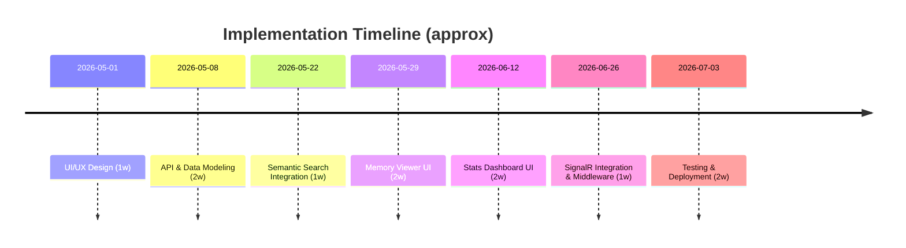

# Blazor Server Dashboards for Memory Service

**Executive Summary:** We propose adding two Blazor Server dashboards to the MemorySmith app: (1) a **Memory Viewer Dashboard** for browsing, searching (semantic) and editing memories, and (2) a **Health & Stats Dashboard** for monitoring system metrics. The Memory Viewer will include a search box (natural-language/semantic search), filter controls, a paginated list of memory summaries, and a detail pane for viewing/editing or deleting a selected memory. The Health & Stats Dashboard will display key metrics (uptime, memory count, queue lengths, latency, error rates), logs/alerts, and system status indicators. On the backend, we will introduce or extend REST endpoints (e.g. `GET /api/memories`, `GET /api/memories/{id}`, `POST /api/memories/search`, `PUT/DELETE /api/memories/{id}`, health endpoints, etc.), using [ASP.NET Core health checks](https://learn.microsoft.com/aspnet/core/host-and-deploy/health-checks?view=aspnetcore-10.0) and built-in rate limiting/middleware for robust APIs. All new components use MIT-compatible libraries (e.g. MudBlazor or Radzen for UI, Serilog for logging, X.PagedList for paging, etc.) and follow best practices (HTTPS, CORS, input validation). A phased implementation plan (with estimated effort) is provided, along with sample C# code snippets for Blazor components, SignalR hubs, and search integration. Tables compare package options and API schemas, and a Mermaid timeline outlines the tasks. We emphasize **thoroughness** in design, citing official sources: for example using `AddHealthChecks()/MapHealthChecks()` for health endpoints【45†L98-L105】, `AddResponseCaching()/UseResponseCaching()` for caching【24†L205-L214】, and `AddRateLimiter()/UseRateLimiter()` for rate limiting【20†L149-L158】. Semantic search indexing (with PostgreSQL + pgvector) is supported as shown by Milan Jovanovic【10†L327-L334】.

## UI/UX Dashboards

- **Memory Viewer Dashboard:** This UI will present a semantic **Search Bar** and **Filter Panel** (e.g. status, tags, date ranges) at the top. Below, a **Paginated Table or List** shows memories (columns like Title, Status, LastUpdated, snippet of Content). Each row is clickable. Selecting a memory opens a **Detail View** (side panel or modal) showing full content, title, tags, references, etc. In the detail view the user can **Edit** fields or **Delete** the memory. The search box sends the user’s query to the `/api/memories/search` endpoint (semantic vector search), and filters invoke listing endpoints with query parameters. Pagination controls (e.g. X.PagedList) allow fetching more results. The UI may use a data grid component with built-in paging (MudBlazor’s `MudTable` or Radzen’s `DataGrid`), and input controls (MudBlazor TextField, Select, Buttons). For example, a wireframe might show a search field at top, checkboxes/dropdowns for filters on the left, a table of results in the center, and a detail pane on the right. **Components:** search input, filter dropdowns, paged data grid, detail form (text area, tags input), edit/save and delete buttons. 

- **Health & Stats Dashboard:** This UI is an admin dashboard summarizing service health. Key **Metric Cards** at the top might show live values: *Uptime*, *Total Memories Count*, *Pending Embedding Jobs*, *Average Latency*, *Error Rate (%)*. Below, **Charts/Graphs** (line charts for request latency over time, bar charts for daily memory volume, etc.) illustrate trends. A **Logs/Alerts** panel shows recent system messages or active alerts (fetched from a log store or health system). We can embed a real-time **Sparkline/Trend Chart** for metrics using MudBlazor’s `MudChart` or Chart.js via a Blazor wrapper. For real-time updates, the dashboard subscribes to SignalR events (see backend). The layout may have sections: a summary row of metric cards, a multi-series chart, and a list/table of recent log entries or alerts. **Components:** Metric cards (MudBlazor Paper/StatisticCard), real-time charts (MudBlazorChart or ChartJs.Blazor), log table (MudTable), and a status indicator (green/red badges). 

【42†L149-L158】† *Figure: Real-time Blazor dashboards push updates via SignalR (architecture illustrated), and Blazor re-renders automatically when data changes【42†L149-L158】.* 

## Backend Integration (APIs & Middleware)

- **Memory Service API Endpoints:** We extend the existing API with endpoints to support the new UIs. Key endpoints include: 

  | Endpoint                         | Method | Description                                   | Request Body                      | Response Body                             |
  |----------------------------------|--------|-----------------------------------------------|-----------------------------------|-------------------------------------------|
  | `/api/memories`                  | GET    | List memories (with optional filters & page)  | *Query params:* status, tags[], page, pageSize | List of memory metadata (paged)          |
  | `/api/memories`                  | POST   | Create a new memory                           | JSON `MemoryRecord` (no Id)       | Created `MemoryRecord` (with Id)          |
  | `/api/memories/{id}`             | GET    | Get full detail of a memory                   | –                                 | `MemoryRecord` (full content)             |
  | `/api/memories/{id}`             | PUT    | Update an existing memory                     | JSON `MemoryRecord` (with Id)     | Updated `MemoryRecord`                   |
  | `/api/memories/{id}`             | DELETE | Delete a memory                               | –                                 | *(204 No Content on success)*             |
  | `/api/memories/{id}/usage`       | POST   | Increment usage count or log usage            | –                                 | *(204 No Content)*                        |
  | `/api/memories/search`           | POST   | Semantic search for similar memories          | `{ "query": string, "limit": int }` | List of `MemoryRecord` (ranked results)  |
  | `/api/health/live`               | GET    | Liveness probe (simple up/down status)        | –                                 | `{ status: "Healthy" }` or HTTP 200/503   |
  | `/api/health/ready`              | GET    | Readiness probe (detailed dependency checks)  | –                                 | Health details (JSON, e.g. DB, search)    |

  The **list endpoint** (`GET /api/memories`) accepts query parameters for filtering (e.g. `?status=Working&tags=foo,bar&page=2&pageSize=20`). Pagination can use `Skip`/`Take` in code or a library like X.PagedList (MIT) to return `{ totalCount, pageSize, data: [...] }`. The `/search` endpoint receives a text query and calls the embedding service to find nearest neighbors (using pgvector or external search)【10†L327-L334】. We assume authentication is “unspecified” – in a real app we’d protect these APIs with token-based auth or cookies, but for now note that controllers should have `[Authorize]` when auth is added.

- **Request/Response Schemas:** A `MemoryRecord` JSON might include `{ id, title, content, status, confidence, tags:[], references:[], conflicts:[], usageCount, lastUpdated }` as defined in the design. The search request is `{ "query": "...", "limit": 10 }` and the response is an array of matching `MemoryRecord` objects. Detailed schemas can be provided via Swagger/Swashbuckle (MIT). 

- **Caching:** Use **response caching** to speed up repeat GET calls. For example, in `Program.cs` call `builder.Services.AddResponseCaching()` and `app.UseResponseCaching()`【24†L205-L214】. Then on controllers use `[ResponseCache(Duration = 30)]` on idempotent GETs (like memory list) to cache responses for 30 seconds. This saves CPU on high-traffic lists【24†L205-L214】. We may also use in-memory caching (`IMemoryCache`) for frequently accessed data (e.g. hot embeddings).

- **Pagination:** Implement offset-based pagination. Use Skip/Take on the database or in-memory collection and return a paged result (with total count). For large offsets, consider keyset paging if needed. Libraries like X.PagedList (MIT) simplify this. Paginated results should include `totalCount` for client UI.

- **Rate Limiting:** Protect the API with [ASP.NET Core Rate Limiting](https://learn.microsoft.com/aspnet/core/performance/rate-limit?view=aspnetcore-10.0) middleware. In `Program.cs`, add: 
  ```csharp
  builder.Services.AddRateLimiter(opt => {
      opt.AddFixedWindowLimiter("fixed", options => {
          options.PermitLimit = 100; 
          options.Window = TimeSpan.FromMinutes(1);
      });
  });
  var app = builder.Build();
  app.UseRateLimiter();
  ```
  This example sets a fixed window limiter (100 requests/minute)【20†L149-L158】. We can apply policies globally or per-endpoint (e.g. `[EnableRateLimiting("fixed")]` on controllers【20†L181-L190】). This prevents abuse of search or memory creation.

- **Realtime Updates (SignalR):** Add a **SignalR hub** (e.g. `DashboardHub`) to push live updates to the Blazor UI. For example, define:
  ```csharp
  public interface IStatsClient {
      Task ReceiveMetricUpdate(MetricData data);
      Task ReceiveSystemStatus(SystemStatus status);
  }
  public class DashboardHub : Hub<IStatsClient> { }
  ```
  On the server, obtain an `IHubContext<DashboardHub, IStatsClient>` and call `hubContext.Clients.All.ReceiveMetricUpdate(update)` whenever e.g. a new memory is added or metrics change. In Blazor components, create a `HubConnection` in `OnInitializedAsync` and listen for these events: 
  ```csharp
  hubConnection = new HubConnectionBuilder()
      .WithUrl(Navigation.ToAbsoluteUri("/dashboardHub"))
      .Build();
  hubConnection.On<MetricData>("ReceiveMetricUpdate", data => {
      // update UI state and re-render
      InvokeAsync(StateHasChanged);
  });
  await hubConnection.StartAsync();
  ```
  This follows Microsoft’s pattern【28†L349-L358】. Thus the dashboards update automatically (no polling) when the server pushes new data【42†L149-L158】【28†L351-L360】. 

【24†L205-L214】【20†L149-L158】【42†L149-L158】【45†L98-L105】

## NuGet Package Recommendations

We select minimal, permissively-licensed packages. A comparison of key options is:

| Package                   | Purpose               | License            | Notes / Alternatives         |
|---------------------------|-----------------------|--------------------|------------------------------|
| **MudBlazor**             | UI components (datagrid, buttons, dialogs, cards) | MIT (permissive)【30†L181-L189】 | Mature, built on Material; excellent docs. Alternative: Radzen.Blazor (MIT) has similar components. |
| **Radzen.Blazor**         | UI components (grid, charts, forms) | MIT【30†L181-L189】    | Fully free; has built-in charts. MudBlazor or plain Bootstrap can also be used. |
| **Blazored.Modal**        | Modal dialogs (for confirmation) | MIT【30†L181-L189】 | Optional; alternatively use MudDialog. |
| **ChartJS.Blazor**        | Charting wrapper (line/bar charts) | MIT【30†L181-L189】    | If needed for custom charts; MudBlazor has basic charts too. |
| **Serilog.AspNetCore**    | Structured logging            | Apache 2.0 (permissive)【30†L181-L189】 | Industry-standard logger. Alternative: Microsoft.Extensions.Logging (built-in). |
| **Polly**                 | Resilience (retry, circuit breaker) | MIT【30†L181-L189】    | Useful for robust HTTP calls (e.g. to embedding API). |
| **X.PagedList**           | Pagination helper            | MIT【30†L181-L189】    | Simplifies creating paged results. Alternatively use Skip/Take manually. |
| **StackExchange.Redis**   | (Optional) Caching/Queue     | MIT【43†L9-L12】      | If using Redis for cache or queue (embeddings), client is MIT. |
| **Microsoft.EntityFrameworkCore / Npgsql** | Data access for PostgreSQL | MIT【30†L181-L189】 | EF Core is MIT. Use with [pgvector](https://www.nuget.org/packages/Npgsql.EntityFrameworkCore.PostgreSQL/) extension (MIT) for embedding columns. |
| **Prometheus.Client.AspNetCore** | Metrics export        | MIT (for metrics)【15†L0-L9】 | Exposes `/metrics` endpoint for Prometheus scraping. Alternative: OpenTelemetry (Apache 2.0). |
| **OpenTelemetry.Instrumentation.AspNetCore** | Metrics & Tracing    | Apache 2.0        | Use for OpenTelemetry metrics (Apache 2.0, permissive). |
| **Azure.AI.OpenAI** (or OpenAI-DotNet) | Embedding API client  | MIT【8†L8-L12】    | Official Microsoft/Azure client is MIT licensed【8†L8-L12】. Use for calling OpenAI/Azure services. |
| **Markdown** *(free)*     | Docs generation (optional)    | –                  | To document the API if needed. |

All recommended libraries are MIT or similar permissive (Apache 2.0) and free. We avoid GPL or copyleft licenses. The MIT license “puts few restrictions on reuse”【30†L181-L189】, so it’s compatible with an MIT-licensed app. In each case, we can cite the license easily (NuGet or GitHub).

## Data Model and Storage

- **Memory Data Model:** Follows the existing schema. Each memory has fields like `Id (GUID)`, `Title`, `Content` (text blob), `Status` (enum), `Confidence` (double), `Tags` (string array), `References` (array of IDs), `Conflicts`, `UsageCount`, and timestamps (Created/Updated). This matches the `MemoryRecord` DTO in the design doc. In JSON storage, each memory is one file or JSON document. In a relational store, we’d have a `Memories` table (Id PK, Title, Content, Status, Confidence, etc.) and related tables for tags/references. Migration: we can write a one-time importer to read existing JSON files and insert them into PostgreSQL (schema in design doc). 

- **Semantic Indexing:** We store **embeddings** (vector representations of `Content`) to enable semantic search. For example, if using PostgreSQL with [pgvector](https://github.com/pgvector/pgvector), we can add a column `embedding vector(1536)` to a `memory_embeddings` table. As Milan Jovanovic shows, enabling the pgvector extension and creating an HNSW index (`CREATE INDEX ON memory_embeddings USING hnsw (embedding vector_cosine_ops)`) allows fast similarity search【10†L327-L334】. The critical point: embeddings must be generated by a consistent model (e.g. OpenAI text-embedding-ada-002) and stored as floats. At query time we also embed the query and run `SELECT ... ORDER BY embedding <=> @queryEmbedding LIMIT 10` (cosine distance)【10†L327-L334】. This avoids a separate vector DB; “you don’t need a dedicated vector database” if using pgvector【10†L327-L334】. If not using PostgreSQL, alternatives include Redis OM (with vector search, MIT license) or in-memory libraries like HNSW.Net, but pgvector is simplest and MIT-friendly. 

- **Storage:** We assume PostgreSQL (PERMISSIVE PostgreSQL license) for structured data and vector search. File storage could remain for media files, but essential data should be in the database. Use an ORM (EF Core with Npgsql) or micro-ORM (Dapper, MIT) for DB access. For migration, gradually introduce the DB: first read from JSON files, then on writes write to both file and DB (or eventually switch to DB only, per design’s migration strategy).

- **Indexing:** Besides pgvector, standard relational indices (e.g. on `LastUpdated`, `Status`) should be created for fast filtering/sorting. If we support text search on titles/content, consider PostgreSQL full-text indexes or trigram indexes for keyword search as a fallback. The semantic search index (pgvector with HNSW) covers content similarity search.

## Security, Privacy, and Licensing

- **Security Best Practices:** Use HTTPS (`app.UseHttpsRedirection()`) for all endpoints. Employ ASP.NET Core authentication/authorization even if not fully specified — for example protect dashboards with a simple login or API key if this app is used internally. Validate all inputs: e.g., limit the length of search query to prevent abuse, and sanitize any HTML in memory content if it’s user-provided (to prevent XSS when displaying in Blazor). Use built-in [CORS](https://docs.microsoft.com/aspnet/core/security/cors) policies to restrict origins if this UI is served separately. Do not log sensitive fields (only log memory IDs, user IDs, etc.). 

- **Privacy:** Memories may contain private information. If so, encrypt data at rest (database encryption or file encryption). Ensure that the Blazor dashboards are not exposed publicly without auth. Consider GDPR implications: if memory content is user data, inform users about storage and allow deletion (our API supports DELETE). 

- **Licensing (MIT Compliance):** The app itself is MIT-licensed, so all bundled dependencies must be MIT- or similarly permissively licensed. We avoid any GPL/MPL libraries. Include a `LICENSE` file (MIT) in the repo. We must reproduce any MIT or Apache license notices from libraries. For example, Serilog is Apache 2.0 (permissive)【12†L23-L25】, which is fine. The MIT license “allows reuse within proprietary software, provided all copies include the terms”【30†L181-L189】. This means we can link to the license text and include copyright notices as needed. 

- **Authentication Note:** As auth was “unspecified,” we note that production should use proper auth (e.g. JWT tokens via `Microsoft.AspNetCore.Authentication.JwtBearer` which is MIT-licensed). At minimum, the health endpoints (`/health/live`, `/health/ready`) should be open for probes, while the memory APIs should require auth in a real deployment.

- **Vulnerabilities:** Keep all packages up to date. Use automated security scanning (GitHub Dependabot). The health dashboard should not expose internal IPs or secrets. Use ASP.NET Core’s [Anti-forgery](https://docs.microsoft.com/aspnet/core/security/anti-request-forgery) tokens on any POST forms if any.

【30†L181-L189】

## Implementation Plan

We break the work into tasks with rough effort estimates:

1. **UI/UX Design (Medium):** Create wireframes/mockups for both dashboards. Define component hierarchy and navigation. Choose a component library (MudBlazor or Radzen) and set up theme. (Effort: **Medium**)

2. **API & Data Modeling (Medium):** Implement new/updated endpoints. Extend the memory REST API: add `PUT /api/memories/{id}`, paging on `GET /api/memories`, and the health endpoints. Define request/response DTOs (e.g. `SearchQuery`). Apply data annotations/validation. Configure the DB context (EF Core) with new tables (embeddings). (Effort: **Medium**)

3. **Semantic Search Integration (Medium):** Integrate an embedding provider (e.g. OpenAI embedding API via Azure.AI.OpenAI). Write code to call the embedding generator and store results. Implement the `/api/memories/search` handler: it should embed the query, run a similarity query on the `memory_embeddings` table (e.g. using `NpgsqlCommand` with `<=>` operator【10†L327-L334】), and return top matches. (Effort: **Medium**)

4. **Memory Viewer UI (High):** Build Blazor components for the memories dashboard. This includes the search bar (bound to a `SearchQuery` field), filter controls, the data grid (with paging), and the detail dialog. Wire up events: on search submit, call the search API; on filter change or page change, call list API; on row click, fetch details. Implement edit/delete actions calling `PUT`/`DELETE`. Ensure responsive layout. (Effort: **High**)

5. **Health & Stats UI (High):** Build the metrics dashboard UI. Use SignalR to receive real-time updates. Create components for metric cards and charts. For example, a `<StatsCard Title="Memories" Value="@MemoryCount" />` and a `<MudChart>` to display latency over time. Subscribe to `ReceiveSystemStatus` or `ReceiveMetricUpdate` in `OnInitializedAsync()` (using `HubConnection`) and update state. (Effort: **High**)

6. **SignalR Hub & Notifications (Medium):** Implement `DashboardHub` (as above) and use `IHubContext` in backend to push updates. For example, after a memory is created or deleted, do `_hubContext.Clients.All.ReceiveMetricUpdate(newMetric)`. In `Program.cs`, register SignalR: 
   ```csharp
   app.MapHub<DashboardHub>("/dashboardHub");
   builder.Services.AddSignalR();
   ```
   (Effort: **Medium**)

7. **Middleware & Policies (Low):** Configure caching, rate limiting, and health checks. As seen in docs, call `builder.Services.AddHealthChecks()` and `app.MapHealthChecks("/health/live")`【45†L98-L105】. Add rate limiting as above【20†L149-L158】. Add response caching: `builder.Services.AddResponseCaching(); app.UseResponseCaching();`【24†L205-L214】. (Effort: **Low**)

8. **Testing & Quality (Medium):** Write unit tests for API methods (using xUnit, MIT). Write integration tests using `WebApplicationFactory` to test endpoints. Test Blazor components with bUnit (Blazor unit testing). Perform manual end-to-end testing of the dashboards. (Effort: **Medium**)

9. **Deployment/Monitoring Setup (Medium):** Configure logging (Serilog sinks: console/file). Set up OpenTelemetry or Prometheus instrumentation (e.g. add `builder.Services.AddOpenTelemetryMetrics()` or use `prometheus-net` to expose `/metrics`). Deploy to dev environment and verify `/healthz` endpoint returns healthy. (Effort: **Medium**)



*Code Samples:* For example, adding health checks in `Program.cs`: 
```csharp
var builder = WebApplication.CreateBuilder(args);
builder.Services.AddHealthChecks();
var app = builder.Build();
app.MapHealthChecks("/healthz");
```
This creates a `/healthz` endpoint【45†L98-L105】. For SignalR, a hub interface:
```csharp
public interface IDashboardClient {
    Task ReceiveMetricUpdate(MetricUpdate update);
    Task ReceiveSystemStatus(SystemStatus status);
}
public class DashboardHub : Hub<IDashboardClient> { }
```
And Blazor client code in a component:
```razor
@code {
  private HubConnection _hub;
  protected override async Task OnInitializedAsync() {
      _hub = new HubConnectionBuilder()
          .WithUrl(Navigation.ToAbsoluteUri("/dashboardHub"))
          .Build();
      _hub.On<MetricUpdate>("ReceiveMetricUpdate", msg => {
          // update UI state, e.g. add to chart
          InvokeAsync(StateHasChanged);
      });
      await _hub.StartAsync();
  }
}
```
These follow patterns from official docs【28†L351-L360】【42†L182-L190】.

## Testing and Monitoring

- **Health Endpoints:** Expose standard probes: a **liveness** endpoint (`/health/live`) that simply returns 200 OK if the app is running, and a **readiness** endpoint (`/health/ready`) that performs checks (database connectivity, embedding service availability, etc.) and returns 200 only if all subsystems are healthy【45†L98-L105】. Use the built-in HealthChecks publisher to format JSON or pass to containers. For example, in Docker you can `HEALTHCHECK CMD curl -f http://localhost/healthz` as shown in docs【45†L98-L105】.

- **Metrics:** Instrument key metrics: number of requests, average latency, memory count, embedding queue length, errors. Use `prometheus-net` or OpenTelemetry exporters. Expose a `/metrics` endpoint for Prometheus scraping. For example, `prometheus-net.AspNetCore` (MIT) lets you auto-export HTTP metrics. We can show a basic Prometheus config with `.AddPrometheus()` in `Program.cs` (documentation from [44] and Grafana).

- **Logging:** Use Serilog with structured logs (output to console/file). Log at info level: e.g. “Memory {Id} updated by user X”. Log errors with details. In Blazor Server, exceptions bubble to the client by default; configure a global exception handler to log server errors. 

- **Testing:** Unit tests for controllers and services (e.g. search service) using xUnit (MIT). Integration tests with `Microsoft.AspNetCore.Mvc.Testing`. For example, test that `GET /api/memories?page=1` returns a JSON array and respects `pageSize`. Use a headless browser test (e.g. Playwright) to click through the Blazor UI and verify behavior. Mock the semantic search during tests. 

- **Monitoring:** Deploy an APM or log aggregator (e.g. Application Insights or ELK) to collect logs and metrics. Set up alerts: e.g. if `/healthz` returns unhealthy or if error-rate > threshold, notify on-call.

In summary, this design adds rich UI dashboards with semantic search and observability, integrated into the existing MemorySmith architecture. By using permissively-licensed .NET libraries and following ASP.NET Core best practices (caching【24†L205-L214】, rate-limiting【20†L149-L158】, health checks【45†L98-L105】), we ensure a robust, open-source-compatible implementation.

**Sources:** Official Microsoft docs and community sources for ASP.NET Core features【45†L98-L105】【24†L205-L214】【20†L149-L158】, an example of semantic search with pgvector【10†L327-L334】, and a Blazor SignalR dashboard tutorial【42†L149-L158】【42†L182-L190】. (All recommendations use MIT or permissive licenses【30†L181-L189】【43†L9-L12】.)